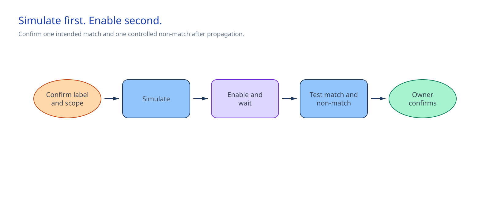

# Microsoft Agent 365 secure rollout and data controls

## Session scope

### What we will do

Configure one scoped Microsoft Purview DLP policy for an approved nonproduction Agent Registry
agent. After the policy is enabled and propagated, install it for the named test group. The agent
can originate in **Microsoft Foundry, Copilot Studio, or Agent Builder**. Confirm that the included
member can use the agent, the excluded user cannot, and the payload-free audit query returns
current activity for the recorded agent instance.

### Why it matters

An Agent Registry entry makes an agent discoverable to administrators. Group installation gives
people access. The inspected DLP gate holds group installation until the control is in place.

### Boundaries

The scope covers one approved nonproduction agent, Agent Registry entry, Entra test group, host
product, labelled synthetic item, label, DLP action, and set of locations. Microsoft 365 admin
center holds installation and consent state. Microsoft Purview holds DLP, labels, audit,
simulation, propagation, findings, and the approved change record. The deployment contract records
installation authorization. Microsoft 365 admin center and Microsoft Purview remain the sources of
truth.

Microsoft Foundry, Copilot Studio, and Agent Builder own the published agent and runtime. Agent
365 DLP governs the selected agent's Microsoft 365 use, not Foundry runtime calls. A Foundry
agent's separate Data Security DLP path needs the Entra-app-scoped rule and application enforcement
of Microsoft Graph `processContent` with signed-in user context. Its named Foundry owners manage
that path. Do not apply it to Copilot Studio or Agent Builder.

## Architecture

### Architecture at a glance



The source-platform owner publishes the supported agent. The Microsoft 365 administrator confirms
its **Available** Agent Registry entry and completes `agent-deployment.json`, including the Agent
365 instance ID that DLP and audit use. The Purview operator creates and simulates the policy from
the approved change. After propagation, the delivery owner updates the DLP gate in the contract to
permit scoped installation. The audit owner queries current Agent 365 operations without exporting
content.

`coverage-handoff.md` assigns the product-boundary owners. Keep the policy, labels, audit events,
simulation result, and propagation decision in Purview and the approved change system.

### Design choices and tradeoffs

| Decision | Chosen approach | Benefits | Costs and limitations | Revisit when |
|---|---|---|---|---|
| Source agent | A published Foundry, Copilot Studio, or Agent Builder agent | Uses a supported Agent 365 entry path | The source platform still governs its runtime | The agent origin or runtime changes |
| Rollout scope | One nonproduction Agent Registry agent and Entra group | Limits access while the control is checked | A broader pilot needs another change | The pilot group expands |
| DLP action | The approved `Block` or `Audit` choice | Follows the data owner's decision | `Audit` records activity but allows it; `Block` can interrupt work | The use case or label changes |
| Installation gate | Recorded `EnabledAndPropagated` state before group installation | Makes the handoff explicit | The operator must inspect Purview and the change record first | A policy changes, is disabled, or is replaced |
| Audit output | Five metadata fields, with no export | Supports a quick check | Investigation detail stays in Purview | Purview changes operation names |

### Architecture guidance

- [Connect existing agents to Microsoft Agent 365](https://learn.microsoft.com/en-us/microsoft-agent-365/connect-existing-agents)
- [Use Microsoft Purview to manage data security and compliance for Microsoft Agent 365](https://learn.microsoft.com/en-us/purview/ai-agent-365)
- [Create and deploy a data loss prevention policy](https://learn.microsoft.com/en-us/purview/dlp-create-deploy-policy)

## Before you start

Confirm the following before opening the portals:

- The source-platform owner published one supported agent. A Foundry agent has completed its
  approved baseline path. A Copilot Studio or Agent Builder owner confirms publication, runtime
  ownership, and lifecycle path.
- The Microsoft 365 administrator can open **Agents > All agents > Registry**, find the agent with
  **Available** status, inspect group installation, and remove that scoped installation.
- The delivery owner approved the nonproduction group, host product, use case, labelled synthetic
  item, label and encryption rights, DLP action and locations, notification and incident route,
  output-label control, and restore route.
- The DLP and label operator has **Compliance Data Administrator** in the approved tenant. The
  audit operator has **View-Only Audit Logs** in Microsoft Purview and Exchange admin center.
- The Microsoft Graph Audit Search application has `AuditLogsQuery.Read.All` application permission
  with administrator consent.
- The Purview operator, Agent 365 owner, information protection owner, source-platform owner,
  data owner, and audit owner accept the responsibilities in `coverage-handoff.md`. For Foundry,
  include the Foundry platform owner and application developer.

### Implementation files

| Type | File | Consumer |
|---|---|---|
| Deployment | [`artifacts/agent-deployment.json`](artifacts/agent-deployment.json) | The Microsoft 365 administrator and Session 06 preflight scripts |
| Record | [`artifacts/governance/coverage-handoff.md`](artifacts/governance/coverage-handoff.md) | The data, information protection, Agent 365, source-platform, and audit owners |
| Runtime | [`artifacts/operations/agent-activity-audit-query.json`](artifacts/operations/agent-activity-audit-query.json) | The Agent 365 audit-query scripts |

Keep tenant IDs, group object IDs, user identities, permission-consent records, policy summaries,
findings, prompts, responses, audit exports, and portal-state copies in approved customer systems.

## Decisions and stop conditions

The approved change and Purview policy summary must match these coordinates:

| Coordinate | Required value |
|---|---|
| Environment | Approved nonproduction environment |
| Agent | One Agent Registry entry with **Available** status |
| Origin | `foundry`, `copilot-studio`, or `agent-builder` |
| People | One approved Entra test group, with a named included member and excluded user |
| Directions | Human-to-agent and agent-to-human |
| Locations | Teams, OneDrive or SharePoint, and email |
| Condition | One approved sensitivity-label ID |
| Action | Recorded `Block` or `Audit` choice |
| Initial state | `TestWithNotifications` |
| Installation state | `EnabledAndPropagated` after the approved propagation allowance |

For an encrypted label, grant the named Agent 365 instance explicit **VIEW** and **EXTRACT**
rights, then directly share the selected SharePoint or OneDrive source. “All users in the
organization” does not grant those rights to the agent.

Choose a labelled destination library, mandatory user labelling, or an approved auto-labelling
policy for generated content. Source labels do not automatically protect new Agent 365 content.

**Stop before a state change** if a license, entitlement, owner, role, permission, coordinate,
synthetic source, output-label control, or restore route is missing. Stop if the Purview summary
is broader than the approved scope, an encrypted source lacks the required rights, or production
data or payload retention enters the path.

For a Foundry agent, do not call Foundry DLP active until both the app-scoped rule and
`processContent` with signed-in user context are in place. Do not assign that Foundry extension to
Copilot Studio or Agent Builder.

## Field reference

Complete every `__REQUIRED_*__` value in `agent-deployment.json`. Before the DLP change, set
`dlpGate.policyState` to `ReadyForSimulation` and `dlpGate.propagationState` to `NotStarted`.
After the Purview operator enables the policy and the delivery owner inspects the recorded
propagation allowance, set them to `EnabledAndPropagated` and `Confirmed`. Those values record
installation authorization. Purview and the approved change record remain authoritative.

The scripts reject every unresolved sentinel. They also reject an installation request unless the
contract contains the post-propagation values above.

## Implement

### 1. Select the agent and configure Agent Registry

Choose one published agent from Foundry, Copilot Studio, or Agent Builder. In **Agents > All agents
> Registry**, confirm that its registry ID and status match the contract. Set the agent origin,
registry ID, Agent 365 instance ID, test group, host product, consent decision, validation aliases,
and DLP pre-change values in `agent-deployment.json`. Confirm that the group has no installation
before DLP is enabled.

Update `coverage-handoff.md` if an owner or product boundary differs from its recorded assignment.

### 2. Preflight the DLP change

Set the values from the approved tenant and registry entry:

```powershell
$approvedTenantId = $env:MICROSOFT365_TENANT_ID
$agentInstanceId = $env:AGENT365_INSTANCE_ID

.\scripts\preflight.ps1 `
  -Phase Dlp `
  -ApprovedTenantId $approvedTenantId `
  -AgentInstanceId $agentInstanceId
```

```bash
approved_tenant_id="${MICROSOFT365_TENANT_ID:?Set MICROSOFT365_TENANT_ID.}"
agent_instance_id="${AGENT365_INSTANCE_ID:?Set AGENT365_INSTANCE_ID.}"

./scripts/preflight.sh \
  --phase dlp \
  --approved-tenant-id "$approved_tenant_id" \
  --agent-instance-id "$agent_instance_id"
```

The portal has no read-only deployment preview. Use the policy summary and
`TestWithNotifications` simulation as the safety check. The DLP preflight does not authorize
installation.

### 3. Configure, simulate, and enable the DLP policy

Create a custom Purview DLP policy from the approved change. Enter the recorded agent, group,
label, directions, locations, action, notification route, incident route, output-label control,
and restore path. Start in `TestWithNotifications`.

Inspect the policy summary and simulation. It must contain the selected agent, group, label,
directions, and locations only. Enable it through the approved change and wait for the recorded
propagation allowance. Keep the policy in simulation or restore it if the inspected scope differs.

### 4. Authorize and install the scoped rollout

After the delivery owner observes the propagation allowance, update the DLP gate values in the
field reference. Run the installation-phase preflight:

```powershell
.\scripts\preflight.ps1 `
  -Phase Install `
  -ApprovedTenantId $approvedTenantId `
  -AgentInstanceId $agentInstanceId
```

```bash
./scripts/preflight.sh \
  --phase install \
  --approved-tenant-id "$approved_tenant_id" \
  --agent-instance-id "$agent_instance_id"
```

Open the recorded registry entry and install the agent for its named test group and one host
product. Use the recorded consent. Do not select an organization-wide deployment.

### 5. Check included and excluded access

The included member must find the agent in the recorded host product. The excluded user must not.
Remove the scoped installation and stop if either result differs. Use the labelled synthetic source
for the DLP interaction.

For a Foundry agent, the Foundry platform owner confirms the separate app-scoped rule and
user-context `processContent` enforcement path. For Copilot Studio and Agent Builder, keep native
runtime controls with the source-platform owner.

### 6. Query current Agent 365 activity

For PowerShell, connect Exchange Online and Security & Compliance PowerShell to the approved
tenant. For Bash, sign in to Azure CLI as the approved Microsoft Graph application.

```powershell
.\scripts\query-agent-activity.ps1 -AgentInstanceId $agentInstanceId
```

```bash
./scripts/query-agent-activity.sh --agent-instance-id "$agent_instance_id"
```

The scripts filter current Agent 365 operations to one instance and display creation time,
operation, agent ID, agent name, and result status. They do not write an audit export.

## Confirm the result

### Intended path

After propagation, run the labelled synthetic interaction through the approved path. `Block` stops
the matched interaction. `Audit` allows it and records the match. Inspect the DLP result, scoped
audit activity, and generated-content label behavior in Purview.

### Blocked or failure path

Repeat the interaction with the approved excluded-user alias. Keep the agent, source, label,
direction, location, and action unchanged. The policy must not report a match.

Stop if the policy reaches a wider scope, the action differs, the output is treated as protected
without the chosen output control, the excluded user finds the agent, the included member cannot
find it, or audit activity remains absent after the recorded ingestion allowance.

### Delivery-owner checkpoint

The delivery owner observes the propagation wait, included-user availability, excluded-user denial,
intended policy result, non-match, and scoped audit activity. Keep the policy in simulation or
disable it if a check fails. Record the result in Purview and the approved change system.

## After implementation

| What remains | Owner |
|---|---|
| DLP policy, simulation and enablement state, findings, and change history | Purview operator and Agent 365 owner |
| Label, encryption rights, and generated-content control | Information protection owner |
| Agent Registry installation and deployment contract | Microsoft 365 administrator |
| Product-boundary ownership record | Data governance owner |
| Published agent and native runtime controls | Source-platform owner |
| Payload-free query definition and audit operation | Audit owner |
| Conditional Foundry Data Security rule and `processContent` integration | Foundry platform owner, Purview operator, and application developer |

Restore through the approved Purview and Microsoft 365 change paths:

1. Return the policy to `TestWithNotifications`.
2. Disable it after reviewing dependencies.
3. Remove the scoped agent installation and group assignment before deleting a policy created for
   this session.
4. Remove label rights or source sharing after the data owner confirms that no Agent 365 dependency
   remains.

Do not delete a reused label, audit records, or source data. For a Foundry agent, use its separate
dependency review to change Foundry coverage or billing. The data governance owner reviews
`coverage-handoff.md` quarterly and after an owner or product-boundary change.
