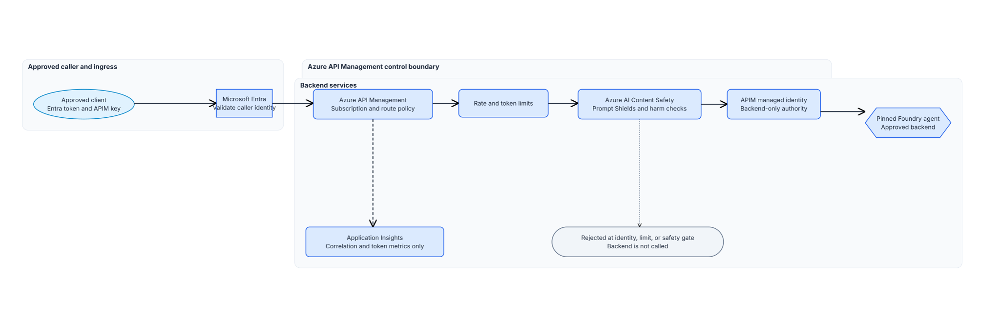

# Azure API Management AI gateway design and implementation

## Session scope

### What we will do

**Objective.** Deploy one controlled Azure API Management route to the
[Governed agent baseline guide](../../04-governed-agent-baseline/implementation/README.md) policy assistant, built from
an agreed **gateway design record**. APIM validates the client token and product subscription,
applies approved limits and Content Safety, then uses its own managed identity to call the pinned
Foundry agent. Confirm the result by sending a synthetic request with an invalid bearer token: APIM
must reject it before Content Safety or Foundry ever sees it.

### Why it matters

**Problem.** An AI gateway change that isn't recorded before deployment can drift from what stakeholders
approved, and forwarding the caller's own credential to Foundry would let a compromised client
reach the agent directly.

**Solution.** This session locks the design record before any change and routes the
backend call through APIM's own managed identity, so client access stays separate from the Foundry
call.

### Boundaries

This session changes child resources in the approved nonproduction APIM instance. APIM is
authoritative for the live route, product, backends, and policy. Foundry is authoritative for the
agent. The repository holds the design record and deployment definitions.

The design record describes the Foundry Agent Service policy-assistant variant used here. Production
ingress, semantic caching, regional failover, and write-capable agents need separate design work.
[API Center and MCP inventory guide](../../07-api-center-ai-mcp-inventory/implementation/README.md) records this route in
API Center. [MCP tool security guide](../../08-mcp-tool-security/implementation/README.md) adds the MCP tool
boundary.

## Architecture

### Architecture at a glance

The caller sends a Microsoft Entra application token and an APIM subscription key. APIM validates
both, applies limits and Content Safety, then exchanges the caller authority for its
system-assigned managed-identity token. It calls the pinned Foundry agent through the approved
backend. Application Insights receives correlation and token metrics without request or response
bodies.

`gateway-design-record.json` records the target scope, backend, identities, network paths, runtime
controls, restore path, owners, and readiness gaps. The combined preflight runs its local record
check before it reads Azure or proposes the deployment.



### Design choices and tradeoffs

| Decision | Chosen approach | Cost and limitation |
|---|---|---|
| Client access | Entra application token plus one APIM subscription per workload | Clients manage both credentials |
| Backend identity | APIM managed identity with Foundry Agent Consumer on one agent | Direct Foundry access needs its own control |
| Safety | APIM Content Safety before the agent RAI policy | It adds latency and a data path |
| Routing | Primary backend with one read-safe retry | Secondary routing stays disabled |
| Telemetry | Correlation and token metrics with body logging disabled | Content is unavailable for debugging |

The retry is safe because the governed agent has a read-only tool.

### Architecture guidance

- [AI gateway capabilities in Azure API Management](https://learn.microsoft.com/en-us/azure/api-management/genai-gateway-capabilities)
- [Authenticate and Authorize to LLM APIs](https://learn.microsoft.com/en-us/azure/api-management/api-management-authenticate-authorize-ai-apis)
- [Azure API Management Backends](https://learn.microsoft.com/en-us/azure/api-management/backends)

## Before you start

Confirm:

- The approved nonproduction scope and change record name the delivery owner.
- The pinned Foundry Agent Service policy assistant endpoint and its network path match the
  approved configuration. The Foundry platform owner confirms both. (The private-networking and governed-agent controls establish these prerequisites.)
- The existing supported APIM instance has a system-assigned managed identity. The gateway owner
  confirms its tier and network path.
- The API product, identity, network, safety, operations, and delivery owners can record decisions
  and resolve readiness gaps.
- The deployment operator has time-bound **Contributor** on the exact APIM resource group.
- The APIM identity has **Foundry Agent Consumer** (`eed3b665-ab3a-47b6-8f48-c9382fb1dad6`) on the
  individual governed agent. It has **Cognitive Services User**
  (`a97b65f3-24c7-4388-baec-2e87135dc908`) on the approved Content Safety resource.
- The Content Safety backend and Application Insights logger use managed identity. The product owner
  issued one workload-specific APIM subscription and stored its key in the approved secret store.

### Implementation files

| Type | File | Consumer |
|---|---|---|
| Record | [`artifacts/gateway-design-record.json`](artifacts/gateway-design-record.json) | The gateway deployment operator and preflight scripts |
| Deployment | [`artifacts/gateway/main.bicep`](artifacts/gateway/main.bicep) | The Session 06 APIM deployment scripts |
| Deployment | [`artifacts/gateway/apis/policy-assistant-responses.openapi.json`](artifacts/gateway/apis/policy-assistant-responses.openapi.json) | The API Management API import |
| Deployment | [`artifacts/gateway/policies/policy.xml`](artifacts/gateway/policies/policy.xml) | The API Management gateway runtime |
| Deployment | [`artifacts/governance/gateway-control.json`](artifacts/governance/gateway-control.json) | The Session 06 preflight and deployment scripts |
| Record | [`artifacts/governance/model-routing-decision.md`](artifacts/governance/model-routing-decision.md) | The API product, platform, safety, and operations owners |
| Deployment | [`artifacts/environments/sandbox.json`](artifacts/environments/sandbox.json) | The Session 06 preflight and deployment scripts |

Keep subscription IDs, backend URLs, keys, bearer tokens, prompts, responses, and customer data
out of the repository.

## Decisions and stop conditions

Resolve every `__REQUIRED_*__` value in the design record, `gateway-control.json`, and
`sandbox.json`. Use an endpoint reference in the design record, never the live endpoint.

Set `recordStatus` to `ready-for-implementation` when no readiness gap is open. Each gap needs an
owner and a resolution action. The record must name `foundry-agent-service` and the
`policy-assistant-responses` variant. Its APIM instance must match `sandbox.json`.

| Control | Approved value |
|---|---:|
| Tokens per minute per APIM subscription | 20,000 |
| Daily token quota per APIM subscription | 500,000 |
| Request body limit | 65,536 bytes |
| Backend response-header timeout | 120 seconds |
| Retry for 429/5xx | 1 |
| Circuit breaker | 5 errors in 1 minute; open for 1 minute |

APIM enables Prompt Shields and checks Hate, SelfHarm, Sexual, and Violence at threshold 4. It logs
zero request and response body bytes and no client IP. Keep the secondary backend disabled.

**Stop before deployment** when the design record is incomplete, a resource differs from approved
inputs, a required role or workload subscription is absent, Content Safety uses a key, or ARM
`what-if` changes APIM itself or an unrelated resource. Stop if a retry could repeat a
consequential action. Do not place live endpoint or customer data in source control.

## Implement

### 1. Record the design

Complete `gateway-design-record.json` with the scope, APIM instance, backend, identities, network
paths, Content Safety decision, telemetry boundary, runtime controls, restore path, owners, and
readiness gaps. Complete `gateway-control.json`, `sandbox.json`, and
`model-routing-decision.md` with the implementation values.

Set the live endpoint values in the shell, not in source control:

```powershell
$approvedSubscriptionId = $env:AZURE_SUBSCRIPTION_ID
$primaryAgentBaseUrl = $env:session06_PRIMARY_AGENT_BASE_URL
$secondaryAgentBaseUrl = $env:session06_SECONDARY_AGENT_BASE_URL
```

```bash
approved_subscription_id="${AZURE_SUBSCRIPTION_ID:?Set AZURE_SUBSCRIPTION_ID.}"
primary_agent_base_url="${session06_PRIMARY_AGENT_BASE_URL:?Set session06_PRIMARY_AGENT_BASE_URL.}"
secondary_agent_base_url="${session06_SECONDARY_AGENT_BASE_URL:-}"
```

### 2. Run preflight and inspect the preview

```powershell
.\scripts\preflight.ps1 `
  -ApprovedSubscriptionId $approvedSubscriptionId `
  -PrimaryAgentBaseUrl $primaryAgentBaseUrl `
  -SecondaryAgentBaseUrl $secondaryAgentBaseUrl
```

```bash
./scripts/preflight.sh \
  --approved-subscription-id "$approved_subscription_id" \
  --primary-agent-base-url "$primary_agent_base_url" \
  --secondary-agent-base-url "$secondary_agent_base_url"
```

Preflight validates the local design record first. It then checks the backend, identity, network,
roles, Content Safety backend, logger, existing marker, and ARM `what-if`.

To run either check by itself, use the paired helper commands:

```powershell
.\scripts\preflight-design.ps1 -DesignRecordPath .\artifacts\gateway-design-record.json
```

```bash
./scripts/preflight-design.sh --design-record-path artifacts/gateway-design-record.json
```

```powershell
.\scripts\preflight-implementation.ps1 `
  -ApprovedSubscriptionId $approvedSubscriptionId `
  -PrimaryAgentBaseUrl $primaryAgentBaseUrl `
  -SecondaryAgentBaseUrl $secondaryAgentBaseUrl
```

```bash
./scripts/preflight-implementation.sh \
  --approved-subscription-id "$approved_subscription_id" \
  --primary-agent-base-url "$primary_agent_base_url" \
  --secondary-agent-base-url "$secondary_agent_base_url"
```

### 3. Deploy the controlled route

```powershell
.\scripts\deploy.ps1 `
  -ApprovedSubscriptionId $approvedSubscriptionId `
  -PrimaryAgentBaseUrl $primaryAgentBaseUrl `
  -SecondaryAgentBaseUrl $secondaryAgentBaseUrl
```

```bash
./scripts/deploy.sh \
  --approved-subscription-id "$approved_subscription_id" \
  --primary-agent-base-url "$primary_agent_base_url" \
  --secondary-agent-base-url "$secondary_agent_base_url"
```

The script reruns preflight and deploys the marked API, product, named values, backend pool,
policy, and body-free diagnostics.

## Confirm the result

Send one synthetic request with the valid workload subscription key and an invalid bearer token.
APIM must return `401 Unauthorized` before calling Content Safety or Foundry. Do not retain the
response, key, or headers.

## After implementation

The delivery owner keeps the design record with the approved change records. The platform owner
maintains the deployment definitions. The product owner owns subscriptions and limits. The safety
owner owns the Content Safety backend and thresholds.

To remove the route, first confirm that no approved consumer uses it. Through the approved APIM
change path, check `implementationSession=06-apim-ai-gateway`. Remove the APIM gateway API, product,
backends, and four nonsecret named values. Leave APIM, Foundry, Content Safety, the logger, role
assignments, and repository definitions in place.
