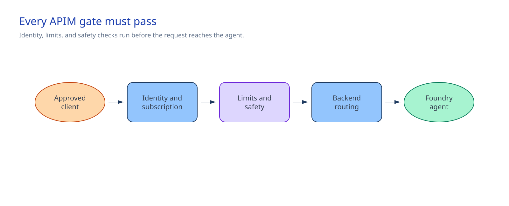

<!-- _class: cover -->

AI Governance Co-implementation · Session 08

# Azure API Management AI gateway implementation

150 minutes · Build the approved Foundry Agent Service route in APIM

<!-- Notes: Session 07 records the design. This session implements its Foundry Agent Service variant. -->

---

## Why it matters

> Configure one API Management route that validates the client token and product subscription,
> applies approved limits and Content Safety, and uses managed identity to call the pinned Foundry
> agent.

This session:

- creates a marked, version-controlled API and controlled product in APIM;
- requires an Entra application token and workload-specific subscription;
- applies size, token, safety, timeout, retry, and circuit-breaker controls in APIM;
- sends correlation and token metrics to Application Insights without bodies; and
- returns `401 Unauthorized` for an invalid bearer identity before Content Safety or Foundry.

This build applies **only** to a Foundry Agent Service policy-assistant endpoint. The Session 07
design record can cover other approved backend types. Each needs its own implementation variant.

<!-- Notes: This control covers traffic sent through the configured route. -->

---

<!-- _class: two-column -->

## Architecture and boundary

The caller sends two credentials: an Entra application token for identity and an APIM subscription
for workload allocation.

APIM checks both, applies limits and Content Safety, then replaces the caller's authorization with
its managed-identity token for Foundry.

APIM owns the live route and policy. Foundry owns the agent. Direct Foundry access needs a separate
control.

<!-- Notes: Keep design-time inventory and runtime enforcement separate. -->

---

<!-- _class: decision -->

## Implementation tradeoffs

| Decision | Chosen approach | Limit |
|---|---|---|
| Client access | Entra app token plus one APIM subscription per workload | Clients manage two credentials |
| Backend access | APIM managed identity with Foundry Agent Consumer on one agent | Direct endpoint still exists |
| Safety | APIM Content Safety before the agent's RAI policy | Adds latency, cost, and a data path |
| Routing | Primary backend with one read-safe retry | Secondary and regional failover remain disabled |
| Telemetry | Correlation and token metrics; zero body logging | Content is unavailable for debugging |

The retry is safe here because the Session 05 agent has a read-only tool.

<!-- Notes: Stop if a retry could repeat a consequential action. -->

---

## Required controls and access

| Control | Required value |
|---|---|
| Design record | Session 07 is `ready-for-implementation`, has no open gaps, and names this APIM instance and Foundry Agent Service variant |
| Operator access | Time-bound Contributor on the exact APIM resource group |
| Foundry access | Foundry Agent Consumer on the individual Session 05 agent |
| Content Safety access | Cognitive Services User on the exact Content Safety resource |
| Token limits | 20,000 TPM and 500,000 tokens/day per subscription |
| Request and backend | 65,536 bytes; 120-second timeout |
| Resiliency | One retry; circuit opens after 5 errors in 1 minute for 1 minute |
| Safety | Prompt Shields; Hate, SelfHarm, Sexual, and Violence at threshold 4 |

APIM counters are gateway-local. Session 15 assigns per-region budgets.

<!-- Notes: The Content Safety backend and Application Insights logger must already exist. -->

---

## Stop before the change when

- A `__REQUIRED_*__` value remains.
- The Session 07 record is incomplete, has an open gap, selects another backend variant, or names another APIM instance.
- Azure targets the wrong subscription, resource group, APIM service, agent, or safety resource.
- APIM lacks its system identity or either scoped role assignment.
- The client identity, audience, app role, or workload subscription is missing or shared.
- Content Safety uses a key, is unreachable, or conflicts with the Session 05 RAI policy.
- The Application Insights logger differs from the approved input.
- ARM `what-if` changes APIM itself, unrelated resources, or the approved API or product ID.
- A live endpoint, key, token, prompt, response, or customer data would enter source control.

<!-- Notes: Preflight checks these gates and ends with ARM what-if. -->

---

<!-- _class: implementation -->

## Implementation path

**Total session: 150 minutes. Guided implementation: about 105 minutes.**

1. Confirm the Session 07 design record and resolve client, ownership, limits, safety, routing, and network inputs.
2. Run paired PowerShell or Bash preflight. It checks the actual backend, identity, network, and ARM `what-if`.
3. Deploy the marked API, product, named values, backend pool, policy, and diagnostics.
4. Use the workload subscription issued before the session.
5. Call the route once with an invalid bearer token.

The remaining time covers briefing, decisions, and the operating handoff.

<!-- Notes: The implementation guide contains the paired commands and exact parameters. -->

---

## Confirm the result

Use:

- the valid workload-specific APIM subscription key;
- `Authorization: ******`; and
- a synthetic request body.

**Expected result: `401 Unauthorized`.**

APIM rejects the identity before calling Content Safety or Foundry. Do not retain the response,
key, or headers. Test other policy branches separately.

<!-- Notes: This is the one standard-mode check. It proves the ingress identity boundary. -->

---

<!-- _class: two-column -->

## Operate and restore

### Keep in operation

- Product owner: subscriptions and limits
- Identity: app role and role assignments
- Platform: APIM capacity and routing
- Safety: backend and thresholds
- Operations: metrics, alerts, retention, and cost

### Restore safely

Check `implementationSession=08-apim-ai-gateway-implementation`. Then remove only the Session 08
API, product, backends, and four named values.

Leave APIM, Foundry, Content Safety, the logger, role assignments, and repository definitions.

<!-- Notes: Disable a secondary by setting secondaryBackendEnabled to false and redeploying. -->

---

## Handoff to Session 09

Session 08 leaves:

- a controlled APIM route to the pinned Foundry agent;
- separate client and backend identities;
- approved limits, safety checks, and body-free telemetry;
- rerunnable deployment definitions and preflight; and
- a scoped restore path.

[Session 09](../09-api-center-ai-mcp-inventory/) records the API and runtime location.
[Session 10](../10-mcp-tool-security/) adds the MCP tool boundary.

<!-- Notes: End on the owned runtime control and the next dependencies. -->

---

<!-- _class: closing -->

# Thank you!
