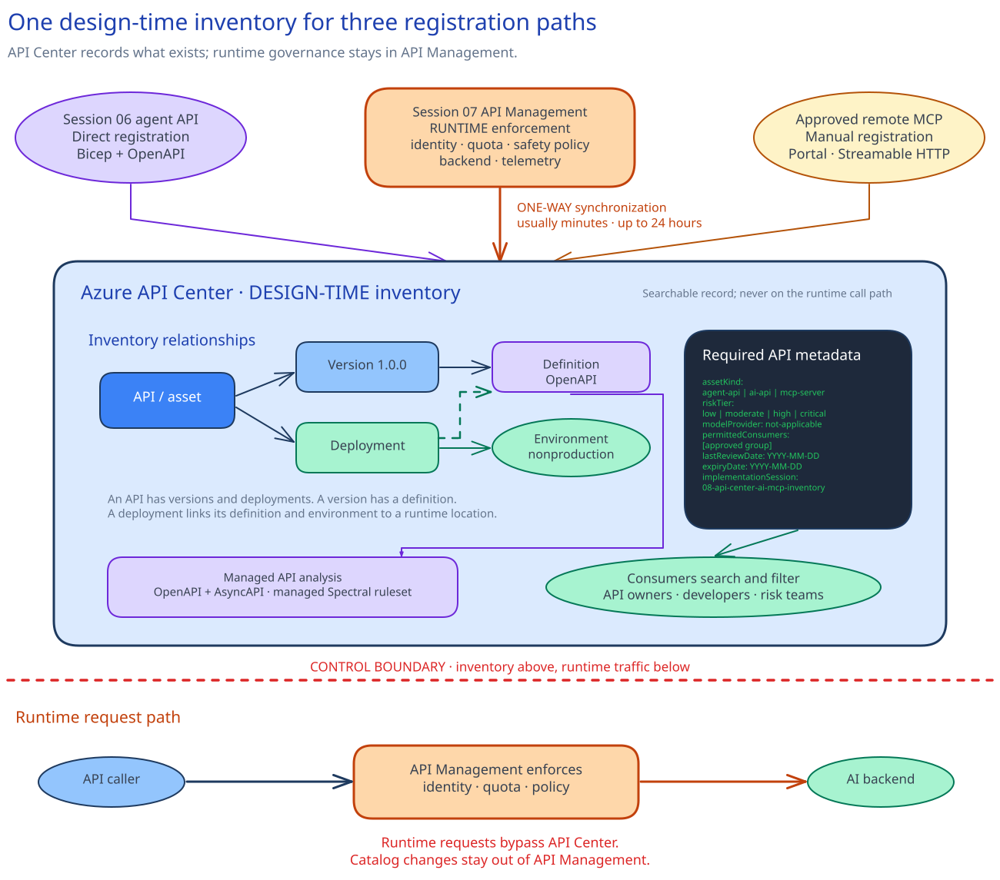

# Azure API Center and the AI/MCP inventory

## Session scope

### What we will do

Add **three selected assets to API Center**: deploy the
[Session 04](../../04-governed-agent-baseline/implementation/README.md) agent API, synchronize the
[Session 07](../../07-apim-ai-gateway-implementation/implementation/README.md) APIM API, and register an approved
remote MCP server.

The three entries receive owner, lifecycle, classification, risk, review, and runtime-location
metadata. The read-only check confirms that each entry appears once and that the APIM integration
points to the approved source.

### Why it matters

Developers need to know what they can use, where it runs, and who owns its review and retirement.
API Center makes missing inventory decisions visible before an asset is treated as approved.

### Boundaries

API Center holds design-time inventory and discovery metadata. Foundry, APIM, and the MCP runtime
remain authoritative for live service state. API Center does not inspect or block runtime calls.
APIM owns runtime controls for the synchronized route, and
[Session 09](../../09-mcp-tool-security/implementation/README.md) governs MCP tool use.

The APIM integration is read-only, one-way, and imports every API from the linked instance. Approve
that full source boundary and assign metadata owners before creating the link. Register the remote
MCP server through the portal because the stable `Microsoft.ApiCenter@2024-03-01` ARM surface does
not expose the native MCP fields.

Production discovery, write-capable MCP tools, the API Center portal, private discovery, Foundry
Toolbox reuse, registry discovery, and A2A inventory need separate approval or their optional
modules.

## Architecture

### Architecture at a glance

Bicep deploys API Center, its metadata schema, the default workspace, the direct agent API, and its
Foundry runtime location. API Center's system identity receives **API Management Service Reader
Role** on the exact Session 07 APIM service. The source integration then imports APIM APIs,
definitions, environments, and deployments.

The API program owner registers the approved remote MCP server in the portal. Asset owners maintain
metadata on the synchronized and portal-created entries.



Live requests stay on the APIM path. Session 09 uses the MCP entry and runtime location for
tool-security work.

### Design choices and tradeoffs

| Decision | Chosen approach | Benefits | Costs and limitations | Revisit when |
|---|---|---|---|---|
| Inventory scope | Direct agent API, linked APIM instance, and one approved remote MCP server | Gives the three selected assets one searchable inventory | Every API in the APIM instance is imported and needs an owner | A narrower supported source is available |
| APIM access | One-way sync with API Management Service Reader Role | Keeps definitions aligned without APIM write access | Initial sync can take up to 24 hours | Selective synchronization becomes available |
| MCP registration | Native portal flow | Uses the supported MCP asset model | A person must maintain the entry | A stable ARM resource exposes the native fields |
| Authoritative state | Design metadata in API Center; runtime state in each service | Keeps inventory and runtime health separate | Owners must update metadata after service changes | A supported integration can update the same fields safely |
| Plan | Record Free or Standard, then confirm it in the portal | Keeps support and cost explicit | Stable Bicep does not set the plan | The stable service API supports plan deployment |

### Architecture guidance

- [Azure API Center overview](https://learn.microsoft.com/en-us/azure/api-center/overview)
- [Synchronize APIs from Azure API Management instance](https://learn.microsoft.com/en-us/azure/api-center/synchronize-api-management-apis)
- [Inventory and discover MCP servers in your API Center](https://learn.microsoft.com/en-us/azure/api-center/register-discover-mcp-server)

## Before you start

Confirm these requirements:

- The approved nonproduction Foundry agent endpoint and APIM API are available. The platform and
  gateway owners confirm the endpoint, marked `policy-assistant-responses` API, and both resource
  scopes. (Sessions 02, 04, and 07.)
- The deployment operator has time-bound **Contributor** on the exact API Center resource group.
- The role-assignment operator has time-bound **User Access Administrator** on the exact APIM
  instance. This permits the API Center identity to receive **API Management Service Reader
  Role** (`71522526-b88f-4d52-b57f-d31fc3546d0d`) at that service scope.
- The API program owner has approved Free or Standard, the current API Center region, and the full
  APIM source boundary. Free has no Microsoft support. Confirm current eligibility or separate cost
  before relying on a linked Standard-plan benefit.
- The APIM API ID `policy-assistant-responses` exists and carries its implementation marker.
- The remote MCP server is read-only and has an approved HTTPS Streamable HTTP endpoint.
- Named owners have completed the metadata decisions for the three selected assets and any other
  API that the APIM link will import.

Keep subscription IDs, endpoints, credentials, tokens, prompts, responses, telemetry, and customer
data out of source control.

### Implementation files

| Type | File | Consumer |
|---|---|---|
| Deployment | [`artifacts/api-center/main.bicep`](artifacts/api-center/main.bicep) | The Session 08 API Center deployment scripts |
| Deployment | [`artifacts/api-center/apim-reader.bicep`](artifacts/api-center/apim-reader.bicep) | The Session 08 API Center deployment scripts |
| Deployment | [`artifacts/api-center/metadata-schemas.json`](artifacts/api-center/metadata-schemas.json) | The API Center metadata-schema resources |
| Deployment | [`artifacts/api-center/agent-api-definition.json`](artifacts/api-center/agent-api-definition.json) | The Session 08 API Center deployment scripts |
| Deployment | [`artifacts/catalog/specs/policy-assistant-agent.openapi.json`](artifacts/catalog/specs/policy-assistant-agent.openapi.json) | The API Center definition import |
| Deployment | [`artifacts/environments/sandbox.json`](artifacts/environments/sandbox.json) | The Session 08 preflight, deployment, and inventory-check scripts |

## Decisions and stop conditions

Complete `sandbox.json` and `agent-api-definition.json`. Resolve every `__REQUIRED_*__` value.

| Decision | Continue when | Stop when |
|---|---|---|
| Inventory and APIM scope | API Center is the approved inventory, and every imported API has a metadata owner | Another inventory is authoritative, or the APIM link would import ownerless assets |
| Plan and region | The live provider advertises the region, and Free or Standard is approved | The region, support position, eligibility, or cost is unresolved |
| Access | Contributor targets the API Center resource group; User Access Administrator targets the exact APIM service | Either assignment is broader than approved, or the API Center identity would receive APIM write access |
| Deployment preview | `what-if` changes the marked API Center scope and exact reader assignment | It replaces or removes unrelated resources, targets another APIM instance, or broadens the role assignment |
| Synchronization | The source is healthy and the Session 07 API appears once | Initial sync is pending or failed; do not create a duplicate API |
| MCP server | The endpoint is approved HTTPS Streamable HTTP, read-only, and owned | It uses `stdio`, embeds credentials, permits writes, or lacks a runtime owner |

Every in-scope entry needs these properties:

| Property | Required decision |
|---|---|
| Business owner | Accountable role or group |
| Technical owner | Operating role or group |
| AI asset kind | `ai-api`, `agent-api`, or `mcp-server` |
| Data classification | `public`, `internal`, `confidential`, or `restricted` |
| Permitted consumers | Approved groups or workload classes |
| Model/provider | Provider, or `not-applicable` for a non-model MCP server |
| Residency profile | Approved processing and storage boundary |
| Risk tier | `low`, `moderate`, `high`, or `critical` |
| Evaluation results URL | Owned evaluation record or backlog |
| Last review and expiry | ISO dates, with expiry after review |
| Implementation session | `08-api-center-ai-mcp-inventory` |

The API program owner defines the schema. Business owners approve consumers and lifecycle.
Technical owners maintain runtime locations and review dates. Data and risk owners maintain
classification, residency, risk, and evaluation destinations.

At expiry, the technical owner has one business day to renew after review, retire and remove the
entry from discovery, or quarantine it from approved use.

## Implement

Use two delivery windows. Window one deploys API Center and starts APIM synchronization. Resume
window two after the source is healthy. The **180-minute duration covers active facilitated work**;
schedule the synchronization wait, which can take up to 24 hours, outside the session timebox.

### 1. Set runtime values

```powershell
$approvedSubscriptionId = $env:AZURE_SUBSCRIPTION_ID
$session04AgentBaseUrl = $env:session08_AGENT_BASE_URL
$remoteMcpServerUrl = $env:session08_MCP_SERVER_URL
$remoteMcpServerTitle = "approved remote MCP server title"
```
```bash
approved_subscription_id="${AZURE_SUBSCRIPTION_ID:?Set AZURE_SUBSCRIPTION_ID.}"
session04_agent_base_url="${session08_AGENT_BASE_URL:?Set session08_AGENT_BASE_URL.}"
remote_mcp_server_url="${session08_MCP_SERVER_URL:?Set session08_MCP_SERVER_URL.}"
remote_mcp_server_title="approved remote MCP server title"
```

The direct agent URL must end at:

```text
https://<account>.services.ai.azure.com/api/projects/<project>/agents/<agent>/endpoint/protocols/openai
```

### 2. Run preflight

```powershell
.\scripts\preflight.ps1 `
  -ApprovedSubscriptionId $approvedSubscriptionId `
  -session04AgentBaseUrl $session04AgentBaseUrl `
  -RemoteMcpServerUrl $remoteMcpServerUrl
```
```bash
./scripts/preflight.sh --approved-subscription-id "$approved_subscription_id" --session04-agent-base-url "$session04_agent_base_url" --remote-mcp-server-url "$remote_mcp_server_url"
```

Preflight rejects unresolved decisions, invalid metadata and URL shapes, the wrong Azure scope,
unsupported regions, an unmarked APIM source, the wrong reader role, and name collisions. It parses
the artifacts, checks the GA `apic-extension` integration command, compiles Bicep, and runs an ARM
`what-if`.

### 3. Deploy and start synchronization

```powershell
.\scripts\deploy.ps1 `
  -ApprovedSubscriptionId $approvedSubscriptionId `
  -session04AgentBaseUrl $session04AgentBaseUrl `
  -RemoteMcpServerUrl $remoteMcpServerUrl
```
```bash
./scripts/deploy.sh --approved-subscription-id "$approved_subscription_id" --session04-agent-base-url "$session04_agent_base_url" --remote-mcp-server-url "$remote_mcp_server_url"
```

The script reruns preflight, deploys the marked API Center and direct agent definition, assigns the
reader role, and creates the APIM integration with specification import enabled.

Confirm the plan in the portal. If Standard is required, complete the approved upgrade after the
eligible APIM integration exists. Wait for **Governed policy assistant Responses API** to appear
once. Stop and resume later if synchronization is still pending.

### 4. Complete live metadata and MCP registration

After synchronization, update the APIM API entry and any other imported APIs with the required
metadata.

Then open **Inventory > Assets > Register an asset > MCP server**:

1. Enter the approved title, description, version, lifecycle, and metadata.
2. Add `$remoteMcpServerUrl` and associate the approved nonproduction environment.
3. Keep Streamable HTTP as the approved runtime transport and create the entry.

API Center may also generate an SSE definition. Do not change the approved runtime transport.
Review managed API analysis for the two OpenAPI definitions. In the portal, confirm that the native
MCP deployment location matches the approved URL and that the runtime is healthy. The stable ARM
and CLI surfaces do not expose those native MCP checks.

## Confirm the result

Run the read-only inventory check:

```powershell
.\scripts\check-inventory.ps1 `
  -ApprovedSubscriptionId $approvedSubscriptionId `
  -RemoteMcpServerTitle $remoteMcpServerTitle
```
```bash
./scripts/check-inventory.sh --approved-subscription-id "$approved_subscription_id" --remote-mcp-server-title "$remote_mcp_server_title"
```

The direct agent API, synchronized Session 07 API, and MCP server must each appear once with the
required metadata. The APIM integration must resolve to the approved source. The script checks
provisioning and source health when the service response exposes them and writes no inventory
export. The owner checks omitted source health, the native MCP deployment location, and MCP runtime
health in the portal. This is an inventory check, not end-to-end runtime validation.

## After implementation

| What remains | Owner |
|---|---|
| API Center service, inventory scope, and metadata schema | API program owner |
| Ownership, consumers, lifecycle, review, and expiry metadata | Business and technical owners |
| Classification, residency, risk, and evaluation destination | Data and risk owners |
| APIM integration and reader assignment | APIM owner |
| OpenAPI definitions and managed analysis findings | API developers |

Run this control in the approved nonproduction inventory. Keep the direct agent definition and
deployment files in source control. Maintain synchronized and native MCP metadata in API Center.

To remove the inventory, the API program owner first confirms that no later session or approved
consumer relies on it. Through the approved Azure change path, check the live
`implementationSession=08-api-center-ai-mcp-inventory` tag, remove the exact APIM reader assignment,
and delete only the marked API Center. Its child inventory resources are deleted with it. The APIM
instance, Foundry agent, remote MCP runtime, runtime policies, and repository definitions remain.
