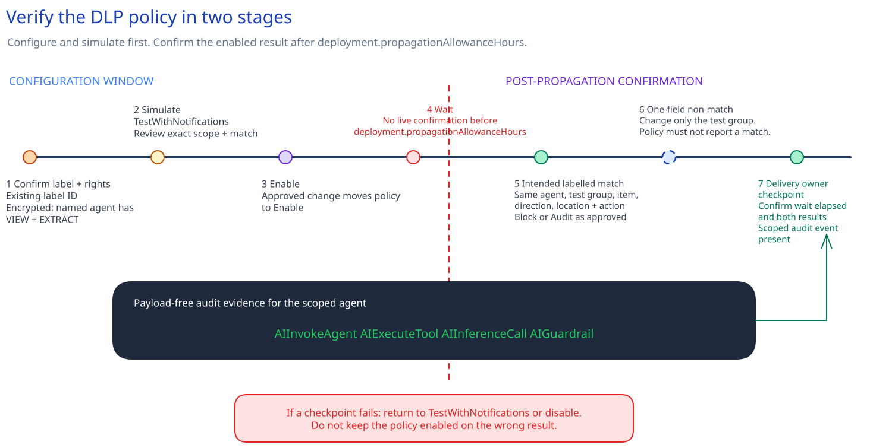

# Purview data governance and Agent 365 data controls

## Session scope

### What we will do

Maintain a **customer-owned coverage handoff** that records the Microsoft Agent 365 and Microsoft
Foundry control split. Confirm the approved label on one synthetic source, configure one scoped
Agent 365 DLP policy, and query payload-free Agent 365 audit activity. The owned result is the
handoff plus one observed policy result for the nonproduction Agent 365 path recorded in the DLP template.

### Why it matters

The handoff stops owners from reading Agent 365 policy coverage as Foundry coverage. It also ties
the selected label, source access, policy scope, and audit route to owners who can maintain them
after delivery.

### Boundaries

The DLP change applies to one nonproduction Agent 365 instance, one test group, the selected
interaction directions and locations, and one approved label ID. Microsoft Purview is
authoritative for live label, DLP, Audit, and DSPM state. The customer-owned handoff records the
coverage decisions and manual checks; it is not a Purview-generated coverage record.

The Agent 365 DLP policy does not govern Foundry. Foundry Purview Data Security, Audit, user
context, and any supported Foundry policy billing remain a separate control path. Production
scope, additional agents, broad populations, new retention or eDiscovery cases, and payload
collection are excluded. The Agent 365, Foundry, data, information-protection, and audit owners
keep their assigned parts of the handoff current.

## Architecture

### Architecture at a glance


This design keeps the Agent 365 and Foundry policy paths separate because their Purview controls
do not have the same scope. On the Agent 365 path, one labelled synthetic item enters a
nonproduction interaction. Purview compares it with the agent, test group, direction, location,
and label named in the DLP policy. The approved action either uses `Block` to stop a match or
`Audit` to record it without stopping the interaction. Unified Audit records the Agent 365
activity. The saved query returns a small set of fields and leaves interaction content in
Microsoft 365.

That policy boundary ends at Agent 365. Foundry Purview Data Security has its own enablement,
billing, user-context, and policy requirements. Treating the two paths as one would overstate the
control.

Microsoft Purview shows the labels, live policy state, Audit records, and Data Security Posture
Management (DSPM) findings. No single service view records who owns the split between Agent 365 and
Foundry, so the customer-owned coverage handoff does that job. The Agent 365 owner maintains the
DLP scope. The Foundry owner carries the separate Foundry result into later work.

### Design choices and tradeoffs

| Decision | Why this design | What it costs | Change it when |
|---|---|---|---|
| Apply DLP to one Agent 365 instance and review Foundry separately | The recorded coverage does not imply that one product protects the other. | Owners maintain two control paths plus the handoff between them. | Microsoft changes the supported Foundry policy surface. |
| Reuse one approved sensitivity label | The synthetic source stays within the existing data taxonomy. | If the label encrypts content, the agent needs explicit VIEW and EXTRACT rights. | The data owner changes the classification or access model. |
| Move from simulation to the approved `Block` or `Audit` action | The live behavior follows the data owner's decision. | `Block` can interrupt work. `Audit` records the match without stopping sharing. | The risk decision or workflow-failure route changes. |
| Keep live state in Purview and the cross-product ownership split in the repository | Operators read service state from Purview; owners can still see who carries each product path. | The handoff must change whenever coverage changes. | A supported service report represents the same ownership boundary. |

### Architecture guidance

Use the
[Purview guidance for Microsoft Agent 365](https://learn.microsoft.com/en-us/purview/ai-agent-365)
to set the agent, direction, location, and encrypted-label rights. Before recording Foundry
coverage, check the separate
[Purview guidance for Microsoft Foundry](https://learn.microsoft.com/en-us/purview/ai-azure-foundry).
The [DLP deployment guidance](https://learn.microsoft.com/en-us/purview/dlp-create-deploy-policy)
covers simulation, enablement, and the propagation wait.

## Before you start

Confirm these prerequisites:

- Sessions 01-09 are complete in the full path. For a focused route, confirm the platform inventory
  lists the exact nonproduction Foundry resource, Foundry project, policy-assistant agent, and Agent
  365 instance.
- For a focused route, confirm the access inventory lists the assignment scope for each Foundry and
  Agent 365 identity.
- For a focused route, confirm the tool control record lists the `get_policy` allowlist, backend
  role definition ID, backend assignment scope, and prohibited-write decision. Before this session
  starts, a read of the labelled synthetic item must succeed and the prohibited write must be absent
  or denied.
- One nonproduction Agent 365 instance and one test group are approved for DLP scope.
- The [Session 06](../../06-governed-agent-baseline/implementation/README.md) Foundry policy assistant and its Azure subscription are available for a separate
  coverage review.
- The synthetic data set contains one item that already has the selected sensitivity label.
- The data owner has approved the prohibited sharing path and either `Block` or `Audit`.
- The tenant has the required Purview, Agent 365, DLP, Audit, and eDiscovery entitlements.
- Pay-as-you-go billing is approved for Foundry policy management.
- Sensitivity labels are enabled for SharePoint and OneDrive.
- If the selected label encrypts content, the Agent 365 instance has explicit VIEW and EXTRACT
  rights. Broad phrases such as all users in the organization are not enough for the agent.
- The DLP and label operator belongs to the **Compliance Data Administrator** role group in the
  approved Microsoft 365 tenant.
- The audit-query operator has **View-Only Audit Logs** in both Microsoft Purview and the Exchange
  admin center.
- The Microsoft Graph application used by `query-agent-activity.sh` has
  **AuditLogsQuery.Read.All** with administrator consent.
- A Compliance Data Administrator has resolved the label ID and confirmed the DLP policy name is
  available in the approved tenant. Record both checks and their dates in the handoff.
- Exchange Online PowerShell is connected to the approved tenant before the audit query runs.

### Implementation files

| Type | File | Consumer |
|---|---|---|
| Record | [`artifacts/governance/coverage-handoff.md`](artifacts/governance/coverage-handoff.md) | The data, information protection, Agent 365, Foundry, and audit owners |
| Runtime | [`artifacts/operations/agent-activity-audit-query.json`](artifacts/operations/agent-activity-audit-query.json) | The Agent 365 audit-query scripts |
| Deployment | [`artifacts/purview/agent365-dlp-policy-template.json`](artifacts/purview/agent365-dlp-policy-template.json) | The Purview DLP operator |
| Record | [`artifacts/purview/dspm-findings-summary.md`](artifacts/purview/dspm-findings-summary.md) | The data, Agent 365, and information protection owners |
| Record | [`artifacts/purview/retained-evidence-checklist.md`](artifacts/purview/retained-evidence-checklist.md) | The data, information protection, DLP, and audit owners |

### Official documentation

Check Microsoft’s [Purview guidance for Microsoft Agent 365](https://learn.microsoft.com/en-us/purview/ai-agent-365)
when deciding policy scope, supported DLP directions, encrypted-label rights, and audit coverage.

## Decisions and stop conditions

Resolve every `__REQUIRED_*__` value before changing tenant state. Use role and group aliases rather
than personal names. Keep tenant IDs, URLs, prompts, responses, user identities, file names, and raw
audit records out of the repository.

**Preflight accepts these proceed states only:**

| Decision | Proceed state |
|---|---|
| Agent 365 qualifying license | `Confirmed` |
| E5 prerequisite | `Confirmed` or `ExceptionApproved` |
| DSPM, DLP, Audit, and eDiscovery entitlements | `Confirmed` |
| Foundry Purview Data Security | `Enabled` |
| Foundry pay-as-you-go policy billing | `Approved` |
| SharePoint and OneDrive label support | `Enabled` |
| VIEW and EXTRACT rights when the label is encrypted | `Confirmed` |
| Externally resolved label identity | `Confirmed` |
| Externally checked DLP policy name | `Available` |

These values record checks completed outside the scripts. They do not replace the tenant or Purview
state that the operator inspected.

### What Purview can enforce for each product

Record Agent 365 and Foundry as separate products in `coverage-handoff.md`.

For Agent 365, the owner manually checks the qualifying per-user license and E5 status. The license
must be `Confirmed`. Record E5 as `Confirmed` or `ExceptionApproved`; the second value requires the
approved exception path. An approved value alone is not proof. The same boundary applies
to Purview entitlements. Run the external checks before preflight and keep the tenant record as the
source of truth.

For Foundry, enable Purview Data Security through Foundry Control Plane or Defender for Cloud.
Manually check the chosen route, pay-as-you-go state, Audit coverage, and whether
the application supplies user context. Here, **user context** means that the Foundry API call uses
Microsoft Entra authentication for the signed-in end user or explicitly includes that end-user
identity. Current DLP enforcement is restricted to supported sensitive-information-type prompt
blocking through that integration. Stop if the team assumes Agent 365 licensing, sensitivity-label
conditions, interaction directions, or DLP policy scope automatically cover Foundry.

### AI data-risk findings

Review DSPM AI observability for the agent and Foundry subscription recorded in the coverage
handoff. This remains a manual
portal check. Keep only short owned summaries for sensitive grounding data, oversharing, and
unlabelled generated content in
[`artifacts/purview/dspm-findings-summary.md`](artifacts/purview/dspm-findings-summary.md). Do not
copy prompts, responses, user identities, source names, URLs, or raw activity rows.

Stop if a finding has no owner or decision, if the team needs raw content in source control, or if
DSPM visibility has not populated for the approved scope.

### Sensitivity label and encryption

Reuse the existing approved label taxonomy. Create a label only when the data owner confirms no
current label expresses the required protection. The selected label must be published to the test
group and available for files and data assets.

If the label encrypts content, explicitly grant the Agent 365 instance VIEW and EXTRACT rights.
Stop if access depends on a broad organization-wide grant, SharePoint and OneDrive label support is
disabled, or the agent is missing from the rights decision.

New content created by Agent 365 does not automatically inherit a source label. Record what the
customer observes and name a compensating control, such as a labelled destination library,
mandatory user labelling, or a separate auto-labelling policy. Do not mark generated content as
protected merely because the source item was labelled.

### DLP policy scope

The approved policy covers:

- one nonproduction Agent 365 instance recorded in the DLP template;
- one approved test group;
- human-to-agent and agent-to-human interactions; and
- Microsoft Teams, OneDrive or SharePoint, and email.

The selected action is `Block` or `Audit`. The agent owner monitors the result because an agent
instance is not aware of a DLP block and downstream workflows can be affected.

Stop if the portal summary contains another agent, user population, location, label, direction, or
action. Also stop if the team tries to use the separate Microsoft 365 Copilot and Copilot Chat DLP
location as a substitute for the Agent 365 instance scope.

### Fields the audit query may return

The operational query uses the current Agent 365 operations:

```text
AIInvokeAgent
AIExecuteTool
AIInferenceCall
AIGuardrail
```

It prints only time, operation, agent ID, agent name, and result status. Do not export the unified
audit log or add prompts, responses, tool arguments, tool results, user identities, file names, or
resource URLs to the repository.

## Implement

### 1. Complete the required decisions

Fill in `coverage-handoff.md` and the audit query. The owners check that the Agent 365 instance ID
and label ID match the approved portal configuration.

Fill in the Purview files under `artifacts/purview/` before portal work starts. The DLP policy
template is a portal checklist, not full policy automation. The DSPM summary records owner
decisions, and the retained evidence checklist states what can remain in the repository.

The data-source inventory uses aliases rather than source URLs. The findings file stores **owned
summaries, not a DSPM export**.

### 2. Verify the manual boundary and run preflight

Before either preflight script runs, a **Compliance Data Administrator** resolves the immutable label
ID and checks the DLP policy name in the Microsoft Purview portal or Compliance PowerShell. Use
`Get-Label` and `Get-DlpCompliancePolicy` when checking through PowerShell. Record `Confirmed` for
the label, `Available` for the policy name, and the verification dates in the manual-check table.

The Bash and PowerShell preflight scripts use Microsoft Graph only for the approved tenant ID and
the Audit Search application permission. They do not call the sensitivity-label API, so
`InformationProtectionPolicy.Read.All` is not required. Keep the tenant ID in the shell only:

```powershell
$approvedTenantId = $env:MICROSOFT365_TENANT_ID

.\scripts\preflight.ps1 `
  -ApprovedTenantId $approvedTenantId
```
```bash
approved_tenant_id="${MICROSOFT365_TENANT_ID:?Set MICROSOFT365_TENANT_ID.}"

./scripts/preflight.sh --approved-tenant-id "$approved_tenant_id"
```

Preflight requires the Markdown handoff and audit query, then rejects unresolved decisions across
both artifacts. It validates the audit query structure and lookback. The Graph token must identify
the approved tenant and include `AuditLogsQuery.Read.All`. DLP deployment state, DSPM findings, and
source access are checked later in the workflow.

A read-only deployment preview is unsupported for this portal-led Agent 365 policy. The safe preview
is the exact portal policy summary followed by `TestWithNotifications` simulation.

### 3. Enable and review Purview data security

For the [Session 06](../../06-governed-agent-baseline/implementation/README.md) Foundry subscription, use the approved route:

1. Enable **Microsoft Purview Data Security** in Foundry Control Plane, or use the approved Defender
   for Cloud route.
2. Confirm pay-as-you-go policy billing is active when the team will manage Foundry interaction
   policies. Purview Audit coverage for Microsoft Foundry is included separately.
3. Record whether the Foundry application supplies user context. Without it, current Purview data
   security policies do not enforce the same way, although Audit and classified activity visibility
   can still be present.

In Purview DSPM AI observability, inspect Agent 365 and Foundry separately. Update the handoff's
`dspmReview` section with owned summaries only.

### 4. Confirm the approved sensitivity label

In **Microsoft Purview > Information Protection > Sensitivity labels**, confirm the selected label
and its publishing policy match the handoff's `label` section.

Do not relabel the item during this session. Confirm the existing label. If it encrypts content, confirm the Agent 365
instance has explicit VIEW and EXTRACT rights. Share the item directly with the agent instance using
the approved source path.

Do not create a new taxonomy for this session. If a new label is unavoidable, pause for the data
owner's decision and record its publication, propagation, and restore impact before continuing.

### 5. Create the Agent 365 DLP policy

In the Microsoft Purview portal, create a custom DLP policy from the handoff's `dlp` section:
Use
[`artifacts/purview/agent365-dlp-policy-template.json`](artifacts/purview/agent365-dlp-policy-template.json)
as the checklist for the portal values. Do not treat it as an unattended deployment script.

1. Use the approved policy name and description marker.
2. Include only the Agent 365 instance recorded in the DLP template and the approved test group.
3. Select both supported interaction directions.
4. Select only the approved Teams, OneDrive or SharePoint, and email paths.
5. Use the approved sensitivity label condition and `Block` or `Audit` action.
6. Route the incident or alert to the assigned owner role without copying content into this
   repository.
7. Start in **Test it out first with policy tips** (`TestWithNotifications`).

Review the final portal summary line by line against the Markdown handoff. Let policy simulation
populate, then confirm the exact agent, group, label, directions, locations, and expected action are
matched. Stop for any unexpected Agent 365 instance, group, label, location, or interaction direction.

End the configuration window after the data owner approves the simulated scope. Switch the policy
to **Turn it on right away** (`Enable`) only through the approved change.
`deployment.propagationAllowanceHours` is the configured number of hours allowed for the enabled DLP
configuration to reach the Agent 365 instance and test group recorded in the DLP template. Schedule confirmation no
earlier than that many hours after enablement.

### 6. Keep the operational audit query

The query definition is already saved in the implementation files. Run it when the audit owner needs a payload-free view of
the scoped agent:

```powershell
.\scripts\query-agent-activity.ps1
```
```bash
./scripts/query-agent-activity.sh
```

The script searches the last 24 hours by default and writes no export.

## Confirm the result

This extended session separates configuration from post-propagation confirmation.



### Intended path

After propagation, run one labelled synthetic interaction through the prohibited sharing path
listed in the policy.
Use the exact Agent 365 instance and test group from the approved scope.
Use Microsoft’s [Copilot and AI application audit
guidance](https://learn.microsoft.com/en-us/purview/audit-copilot) when interpreting the resulting
payload-free activity.

Expected result:

- `Block`: the prohibited agent-to-human or human-to-agent path does not complete; or
- `Audit`: the interaction completes and the configured DLP match is recorded without blocking.

For the same interaction, confirm the unified audit log contains the scoped Agent 365 activity and
inspect the newly created output's label. Record the observed label behavior and compensating
control in the handoff's `label` section. The expected default is no automatic inheritance from
the source item.

### Blocked or failure path: out-of-scope non-match

Repeat the intended interaction and change exactly one approved coordinate: replace the test group
with the out-of-scope test group alias from the DLP policy section of `coverage-handoff.md`. Keep
the Agent 365 instance, labelled synthetic item, interaction
direction, location, and action unchanged. The interaction must not be reported as a match for this
policy.

Stop if the policy affects the out-of-scope group, the outcome differs from the operational action,
the audit event is absent after the explicit Audit ingestion allowance recorded by the audit owner
in the approved change record, protected content appears outside the approved path, or anyone
proposes retaining the prompt, response, screenshot, or audit export.

### Delivery-owner checkpoint

The delivery owner confirms that the configured wait from
`deployment.propagationAllowanceHours` elapsed, the intended policy result occurred, the
one-coordinate test-group change did not match, and the scoped audit event appeared. Keep the policy
in simulation or disable it if any checkpoint fails.

## After implementation

Keep the **scoped DLP policy and coverage handoff in operation**, together with the reused
sensitivity label and publishing decision, Foundry enablement, audit query, and scripts. The data
owner owns the classification and prohibited path. The information protection owner maintains the
label. The Agent 365 owner monitors workflow impact. The Foundry owner maintains separate
user-context and Purview integration. The audit owner maintains the operation query.

Run this implementation only against the Agent 365 instance, test group, synthetic source, and
Foundry subscription recorded in the coverage handoff and DLP template. It does not approve production scope, additional
agents, broad user populations, new retention or eDiscovery cases, payload collection, or a general
Foundry DLP integration.

Restore is manual because DLP policy scope, label publication, encryption rights, and Foundry data
security can have dependencies outside this session:

1. Change the Session 10 DLP policy back to `TestWithNotifications` to remove blocking while keeping
   visibility.
2. Disable the policy only after the data and agent owners confirm no active workflow depends on it.
3. Remove the Agent 365 instance and test group from the policy before deleting the policy.
4. Remove the agent's explicit label rights or source share only after the data owner confirms that
   the handoff's `sourceAccess` section has no dependent Agent 365 instance or group.
5. If this session created a label, unpublish it from the test group and complete the approved
   label-impact review before deletion. Do not delete a reused label.
6. Disable Foundry Purview Data Security or pay-as-you-go policy billing only when the Foundry and
   compliance owners confirm no other application depends on that coverage.

The synthetic data set and implementation definitions remain. Do not delete customer source data,
existing labels, Agent 365, Foundry resources, or Audit records as a restore shortcut.
