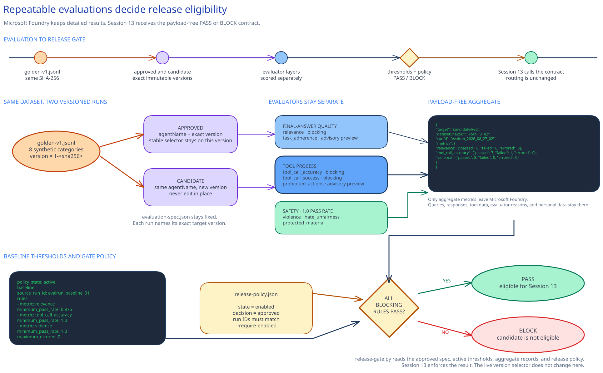

# Foundry evaluations and release quality gates

## Session scope

### What we will do

Create and run a callable release gate for fixed agent versions. Run the versioned
golden data set against the approved and candidate versions. The approved aggregate must return
`PASS`, and the in-memory tool-process regression must return `BLOCK`.

### Why it matters

The gate answers one narrow release question without averaging away a failed tool path or safety
metric. Session 13 can consume the same contract in its protected promotion path.

### Boundaries

Microsoft Foundry holds queries, responses, tool calls, evaluator reasons, and row-level results.
The approved release platform holds run aggregates, activation, and promotion decisions. The
repository keeps version-controlled evaluation definitions, thresholds, and release policy.

The gate does not change the stable endpoint or promote an agent. Preview task-adherence,
prohibited-action, and sensitive-data-leakage evaluators stay advisory. Session 08 remains the
authorization boundary for prohibited writes.

## Architecture

### Architecture at a glance



The same synthetic data set evaluates two fixed versions. Foundry stores the detailed result. The
runner writes a payload-free aggregate to the approved external release store, and the gate applies
the repository-owned threshold and release-policy contract to those live inputs.

### Design choices and tradeoffs

| Decision | Chosen approach | Benefits | Costs and limitations | Revisit when |
|---|---|---|---|---|
| Test data | Versioned synthetic golden set. | Comparable runs. | Content changes need a new baseline. | Use cases or risks change. |
| Gate layers | Final-answer quality, tool process, and safety remain separate. | A strong average cannot hide a failure. | More than one owner maintains thresholds. | Evaluator behavior changes. |
| Protected material | Keep it blocking in East US 2. | Retains the approved safety check. | The run stops if the supported path is unavailable. | Regional support expands. |
| Operational state | Foundry and the release platform retain live runs and activation. | Avoids repository snapshots. | The gate reads external results. | The approved release platform changes. |

### Architecture guidance

Use the [cloud evaluation SDK guide](https://learn.microsoft.com/en-us/azure/foundry/how-to/develop/cloud-evaluation)
for evaluation runs and result handling. Use the
[agent evaluation guidance](https://learn.microsoft.com/en-us/azure/foundry/observability/how-to/evaluate-agent)
for exact agent-version targeting. Check the
[evaluation support guidance](https://learn.microsoft.com/en-us/azure/foundry/concepts/evaluation-regions-limits-virtual-network)
before each run.

## Before you start

Confirm these prerequisites:

- The approved and candidate versions are separate immutable versions of the Session 05 agent.
- The stable endpoint remains pinned to the approved version.
- The quality owner has confirmed current regional support, selected evaluators, and budget.
- Protected-material evaluation runs in East US 2 while it remains a blocking metric.
- The tool owner approves the supported Function Tool path.
- The operator and project managed identity have **Foundry User** on the exact project.
- The golden data set contains synthetic content only.

### Implementation files

| Type | File | Consumer |
|---|---|---|
| Runtime | [`artifacts/eval/evaluation-spec.json`](artifacts/eval/evaluation-spec.json) | The evaluation runner, release gate, preflight scripts, and Session 13 validators |
| Runtime | [`artifacts/eval/data/golden-v1.jsonl`](artifacts/eval/data/golden-v1.jsonl) | The evaluation runner and release gate |
| Deployment | [`artifacts/eval/thresholds.yaml`](artifacts/eval/thresholds.yaml) | The release gate, preflight scripts, and Session 13 validators |
| Deployment | [`artifacts/release/release-policy.json`](artifacts/release/release-policy.json) | The release owner, release gate, preflight scripts, and Session 13 promotion workflow |
| Record | [`artifacts/operations/disable-and-restore.md`](artifacts/operations/disable-and-restore.md) | The release owner and incident operator |

## Decisions and stop conditions

Resolve required configuration values through the approved delivery change path. Keep project
endpoints, resource IDs, subscriptions, tokens, prompts, responses, tool payloads, and personal data
out of the repository.

Stop when an agent version is implicit or mutable, the project or region is outside scope, a preview
evaluator becomes blocking, a limited-support tool enters the evaluated path, a safety or
tool-process failure is treated as overridable, or a current result would be written under this
repository.

The release owner updates the version-controlled policy when evaluators, tools, or thresholds
change. Foundry and the release platform record support checks, run IDs, activation, and decisions.

## Implement

### 1. Set runtime context

Complete the shared Execution environment setup in the root README before this step. Sign in to
Azure CLI for the approved subscription and install the required Python dependencies. Then keep the
current resource coordinates and external release-store path in the shell:

```powershell
$approvedSubscriptionId = $env:AZURE_SUBSCRIPTION_ID
$env:FOUNDRY_RESOURCE_ID = $env:APPROVED_FOUNDRY_RESOURCE_ID
$env:FOUNDRY_PROJECT_ENDPOINT = $env:APPROVED_FOUNDRY_PROJECT_ENDPOINT
$env:FOUNDRY_MODEL_NAME = $env:APPROVED_EVALUATION_MODEL
$releaseStore = $env:APPROVED_RELEASE_STORE
```

```bash
approved_subscription_id="${AZURE_SUBSCRIPTION_ID:?Set AZURE_SUBSCRIPTION_ID.}"
export FOUNDRY_RESOURCE_ID="${APPROVED_FOUNDRY_RESOURCE_ID:?Set APPROVED_FOUNDRY_RESOURCE_ID.}"
export FOUNDRY_PROJECT_ENDPOINT="${APPROVED_FOUNDRY_PROJECT_ENDPOINT:?Set APPROVED_FOUNDRY_PROJECT_ENDPOINT.}"
export FOUNDRY_MODEL_NAME="${APPROVED_EVALUATION_MODEL:?Set APPROVED_EVALUATION_MODEL.}"
release_store="${APPROVED_RELEASE_STORE:?Set APPROVED_RELEASE_STORE outside this repository.}"
```

### 2. Run the preflight

```powershell
.\scripts\preflight.ps1 `
  -ApprovedSubscriptionId $approvedSubscriptionId `
  -Phase Baseline
```

```bash
./scripts/preflight.sh \
  --approved-subscription-id "$approved_subscription_id" \
  --phase baseline
```

Preflight resolves the exact Foundry targets and validates configuration before the billable run.
The Evals API has no dry run.

### 3. Run the approved version and set thresholds

```powershell
python .\scripts\run-evaluation.py `
  --spec .\artifacts\eval\evaluation-spec.json `
  --target approved `
  --output (Join-Path $releaseStore "approved-baseline.json")
```

```bash
python ./scripts/run-evaluation.py \
  --spec ./artifacts/eval/evaluation-spec.json \
  --target approved \
  --output "$release_store/approved-baseline.json"
```

Inspect row-level detail in Foundry. The release owner and control owners establish active thresholds
from the approved result through the delivery change path. The current baseline run ID and approval
remain in Foundry and the release platform.

### 4. Run and gate the candidate version

```powershell
.\scripts\preflight.ps1 `
  -ApprovedSubscriptionId $approvedSubscriptionId `
  -Phase Candidate

python .\scripts\run-evaluation.py `
  --spec .\artifacts\eval\evaluation-spec.json `
  --target candidate `
  --output (Join-Path $releaseStore "candidate.json")

python .\scripts\release-gate.py `
  --policy .\artifacts\eval\thresholds.yaml `
  --spec .\artifacts\eval\evaluation-spec.json `
  --dataset .\artifacts\eval\data\golden-v1.jsonl `
  --baseline-result (Join-Path $releaseStore "approved-baseline.json") `
  --candidate-result (Join-Path $releaseStore "candidate.json") `
  --evaluated-target candidate `
  --expect pass
```

```bash
./scripts/preflight.sh \
  --approved-subscription-id "$approved_subscription_id" \
  --phase candidate

python ./scripts/run-evaluation.py \
  --spec ./artifacts/eval/evaluation-spec.json \
  --target candidate \
  --output "$release_store/candidate.json"

python ./scripts/release-gate.py \
  --policy ./artifacts/eval/thresholds.yaml \
  --spec ./artifacts/eval/evaluation-spec.json \
  --dataset ./artifacts/eval/data/golden-v1.jsonl \
  --baseline-result "$release_store/approved-baseline.json" \
  --candidate-result "$release_store/candidate.json" \
  --evaluated-target candidate \
  --expect pass
```

## Confirm the result

### Intended path

Run the gate against the approved aggregate as both inputs. It returns `PASS` when every
blocking metric is present, has zero errors, and meets its active threshold.

### Blocked or failure path

```powershell
python .\scripts\test_release_gate.py --mode blocked-tool-process
```

```bash
python ./scripts/test_release_gate.py --mode blocked-tool-process
```

The in-memory test returns `BLOCK` for tool-call accuracy and tool-call success while final-answer
quality and safety remain passing. It creates no dataset, cloud resource, or repository file.

### Delivery-owner checkpoint

The release owner observes both gate outcomes and the candidate result in the approved release
platform. A blocked candidate remains unpinned. An enabled delivery integration may make a passing
candidate eligible for Session 13, but it does not promote the version by itself.

## After implementation

Keep the golden data, evaluation specification, threshold policy, release policy, scripts, and
disable-and-restore runbook in operation. Foundry and the release platform retain run and decision
records. The quality owner owns the data and thresholds; the safety owner owns the safety boundary;
the tool owner owns tool-process compatibility; and the release owner owns the stable selector and
delivery integration.

Use [`artifacts/operations/disable-and-restore.md`](artifacts/operations/disable-and-restore.md) to
keep or restore the approved version, remove delivery integration after dependency review, and
cancel unnecessary evaluations. The scripts never change the stable endpoint or delete cloud state.
