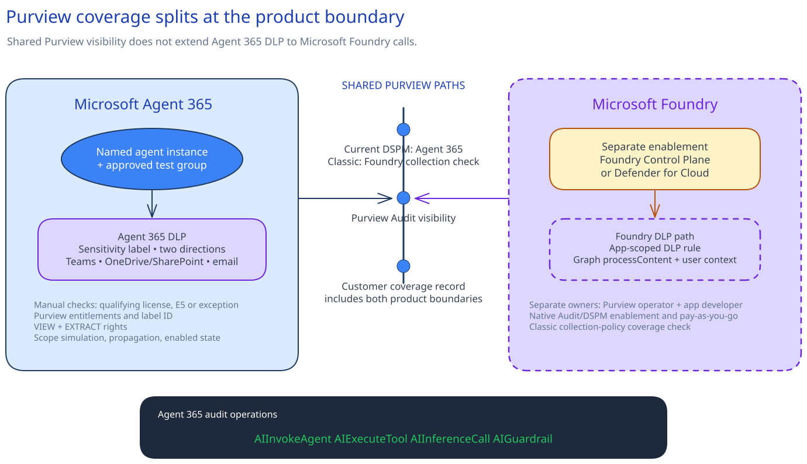

# Implement Purview data governance and Agent 365 data controls

## Session scope

### What we will do

Keep a source-controlled ownership record for the separate Agent 365 and Foundry DLP paths.
Configure one Agent 365 DLP policy for the approved nonproduction scope from current Microsoft
Purview state. After simulation and propagation, confirm the intended result, one out-of-scope
non-match, agent availability, and payload-free audit activity.

### Why it matters

Agent 365 and Foundry use different DLP paths. The ownership record makes that boundary explicit,
while Purview remains authoritative for labels, policies, findings, and audit activity.

### Boundaries

The change covers one approved nonproduction Agent 365 instance, test group, sensitivity label,
action, interaction directions, and set of locations. Purview and the approved change system hold
the policy coordinates, simulation, enablement, results, and restore decision.

The Agent 365 policy does not govern Foundry calls. Foundry DLP needs an Entra-app-scoped rule and
application integration that calls Microsoft Graph `processContent` with signed-in user context.
That rule and integration remain a separate approved change.

Keep tenant IDs, source URLs, prompts, responses, identities, file names, audit exports, findings,
screenshots, and portal-state copies out of the repository.

## Architecture

### Architecture at a glance



On the Agent 365 path, Purview evaluates the agent, group, direction, location, and label. It then
applies the approved `Block` or `Audit` action. The audit scripts query current activity and display
five payload-free fields.

Foundry Data Security follows its own enablement and DLP path. `coverage-handoff.md` names the
owners on both sides. `agent-activity-audit-query.json` defines the repeatable Agent 365 query.

### Design choices and tradeoffs

| Decision | Chosen approach | Tradeoff |
|---|---|---|
| Product boundary | Keep Agent 365 and Foundry DLP separate | Owners maintain two control paths |
| DLP scope | One nonproduction agent and test group | Broader rollout needs another approval |
| Action | Use the approved `Block` or `Audit` choice | `Block` can interrupt work; `Audit` does not stop it |
| Audit output | Display metadata fields without an export | Investigation detail stays in Purview |

### Architecture guidance

- [Purview guidance for Microsoft Agent 365](https://learn.microsoft.com/en-us/purview/ai-agent-365)
- [Purview guidance for Microsoft Foundry](https://learn.microsoft.com/en-us/purview/ai-azure-foundry)
- [Create and deploy a DLP policy](https://learn.microsoft.com/en-us/purview/dlp-create-deploy-policy)

## Before you start

Confirm:

- The Sessions 01-07 records identify the exact Foundry resource and project, policy-assistant
  agent, Agent 365 instance, identity scopes, `get_policy` allowlist, backend role definition ID and
  scope, successful labelled-item read, and absent or denied prohibited write.
- The data owner approved the nonproduction Agent 365 instance, test group, synthetic labelled
  item, label and encryption rights, DLP action and locations, generated-content control, and
  restore route.
- The required Purview, Agent 365, Audit, DLP, eDiscovery, and pay-as-you-go entitlements are
  confirmed. Agent 365 needs a qualifying license; Microsoft recommends E5.
- The DLP and label operator has **Compliance Data Administrator** in the approved Microsoft 365
  tenant.
- The audit operator has **View-Only Audit Logs** in both Microsoft Purview and the Exchange admin
  center.
- The Microsoft Graph application used for Audit Search has the
  `AuditLogsQuery.Read.All` application permission with administrator consent.
- The Purview operator, Agent 365 owner, Foundry platform owner, application developer,
  information protection owner, data owner, and audit owner accept their recorded responsibilities.

### Implementation files

| Type | File | Consumer |
|---|---|---|
| Record | [`artifacts/governance/coverage-handoff.md`](artifacts/governance/coverage-handoff.md) | The data, information protection, Agent 365, Foundry, and audit owners |
| Runtime | [`artifacts/operations/agent-activity-audit-query.json`](artifacts/operations/agent-activity-audit-query.json) | The Agent 365 audit-query scripts |

## Decisions and stop conditions

The approved change and Purview policy summary must match these coordinates:

| Coordinate | Required value |
|---|---|
| Environment | Approved nonproduction environment |
| Agent | One approved Agent 365 instance |
| People | Approved test group |
| Directions | Human-to-agent and agent-to-human |
| Locations | Teams, OneDrive or SharePoint, and email |
| Condition | One approved sensitivity-label ID |
| Action | Recorded `Block` or `Audit` choice |
| Initial state | `TestWithNotifications` |
| Enablement | Approved change after simulation review and the recorded propagation wait |

The DLP operator also records the notification route, incident route, output-label control, and
restore path.

**Stop before the change** if a license, entitlement, owner, role, coordinate, or restore route is
missing; if the live summary is broader than the approved scope; or if production data or payload
retention enters the path.

For an encrypted label, the named Agent 365 instance needs explicit **VIEW** and **EXTRACT** rights
plus a direct share to the selected SharePoint or OneDrive source. “All users in the organization”
does not grant those rights to the agent.

Source labels do not automatically protect new Agent 365 content. Choose a labelled destination
library, mandatory user labelling, or an approved auto-labelling policy before live confirmation.

Do not report Foundry DLP as active without both the app-scoped rule and `processContent` with user
context. Update `coverage-handoff.md` after an owner or boundary change and review it quarterly.

## Implement

### 1. Confirm current state and ownership

Check the approved label, publishing scope, encrypted-label rights, generated-content control, and
synthetic source. Confirm that `coverage-handoff.md` names the Foundry rule owner and application
developer. Keep the current policy and approval in Purview and the approved change system.

### 2. Run preflight

```powershell
$approvedTenantId = $env:MICROSOFT365_TENANT_ID
$agentInstanceId = $env:AGENT365_INSTANCE_ID

.\scripts\preflight.ps1 `
  -ApprovedTenantId $approvedTenantId `
  -AgentInstanceId $agentInstanceId
```

```bash
approved_tenant_id="${MICROSOFT365_TENANT_ID:?Set MICROSOFT365_TENANT_ID.}"
agent_instance_id="${AGENT365_INSTANCE_ID:?Set AGENT365_INSTANCE_ID.}"

./scripts/preflight.sh \
  --approved-tenant-id "$approved_tenant_id" \
  --agent-instance-id "$agent_instance_id"
```

Preflight checks the supplied tenant and agent scope, Graph permission, retained artifacts, and
payload-free query contract. This portal-led change has no read-only deployment preview. Use the
portal summary and `TestWithNotifications` simulation.

### 3. Configure, simulate, and enable the policy

Create a custom Purview DLP policy from the approved change. Enter the recorded coordinates,
notification and incident routes, and restore path. Start in `TestWithNotifications`.

Review the policy summary and simulation. It must contain the selected agent, group, label,
directions, locations, and nothing else. Enable the policy through the approved change, then wait
for its recorded propagation allowance. Keep it in simulation or restore it if the scope differs.

### 4. Install the approved agent after propagation

Open the Session 06 deployment contract at
`sessions/06-agent-365-access-boundary/implementation/artifacts/agent-deployment.json`. Confirm the
agent, test group, host product, and consent decision. Install that agent for the recorded group and
host product, with the recorded consent.

The included member must find the agent. The excluded user must not. Remove the installation and
stop if either result differs. Use the labelled synthetic source for the later interaction.

### 5. Query current Agent 365 activity

For PowerShell, connect Exchange Online and Security & Compliance PowerShell to the approved
tenant. For Bash, sign in to Azure CLI as the approved Microsoft Graph application.

```powershell
.\scripts\query-agent-activity.ps1 -AgentInstanceId $agentInstanceId
```

```bash
./scripts/query-agent-activity.sh --agent-instance-id "$agent_instance_id"
```

The scripts filter the current Agent 365 operations to one instance and display creation time,
operation, agent ID, agent name, and result status. They write no audit export.

## Confirm the result

### Intended path

After propagation, run the labelled synthetic interaction through the approved path. `Block` stops
the matched interaction. `Audit` allows it and records the match. Inspect the DLP result, scoped
audit activity, and generated content's label behavior in Purview.

### Blocked or failure path

Repeat the interaction with the approved out-of-scope test-group alias. Keep the agent, source,
label, direction, location, and action unchanged. The policy must **not report a match**.

Stop if the policy reaches a wider scope, the action differs, the output is treated as protected
without the chosen output control, or audit activity remains absent after the recorded ingestion
allowance.

### Delivery-owner checkpoint

The delivery owner observes the propagation wait, included-user availability, excluded-user
denial, intended policy result, non-match, and scoped audit activity. Keep the policy in simulation
or disable it if a check fails. Record both results in Purview and the approved change system.

## After implementation

| What remains | Owner |
|---|---|
| DLP policy, simulation and enablement state, findings, and change history | Purview operator and Agent 365 owner |
| Label, encryption rights, and generated-content control | Information protection owner |
| Cross-product ownership record | Data owner |
| Payload-free query definition and audit operation | Audit owner |
| Foundry Data Security, app-scoped rule, and `processContent` integration | Foundry platform owner, Purview operator, and application developer |

Restore through the approved Purview change path:

1. Return the policy to `TestWithNotifications`.
2. Disable it after reviewing dependencies.
3. Remove the scoped agent and group before deleting a policy created for this session.
4. Remove label rights or source sharing only after the data owner confirms that no Agent 365
   dependency remains.

Do not delete a reused label, Foundry coverage, audit records, or source data. Change Foundry
coverage or billing only through its separate dependency review.
