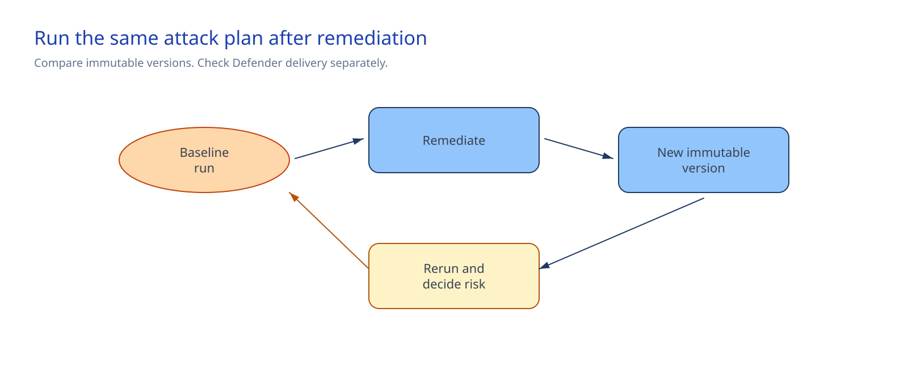

<!-- _class: cover -->

AI Governance Co-implementation · Session 10

# Red teaming, prompt injection, and Defender

240 minutes · Compare fixed versions, then confirm the Defender-to-SOC route

<!-- Notes: Remediation is complete before the session. Today we compare two authorized versions. -->

---

## Why it matters

**Problem.** A better average attack-success rate can hide a worse result in one risk category, and
a broken alert route leaves the security team blind right after remediation.

**Solution.** The per-risk comparison catches a category regression that an average would hide, and
the route check confirms Defender can reach the team that must respond. Existing tool and backend
controls independently deny prohibited writes.

<!-- Notes: A model refusal is not the write boundary. -->

---

<!-- _class: two-column -->

## Architecture

Foundry owns taxonomy and run detail.

The approved security record store holds payload-free aggregates.

Defender and the SOC system own alert and delivery state.

The change system holds authorization, remediation, and residual-risk decisions.

<!-- Notes: Keep red-team improvement and SOC delivery as separate operating facts. -->

---

<!-- _class: decision -->

## Implementation tradeoffs

| Decision | Required answer |
|---|---|
| Scope | Exact nonproduction project, agent, immutable versions, run window, and stop contact |
| Plan | Approved prohibited actions, `Jailbreak`, `Flip`, `Base64`, `IndirectJailbreak`, and three evaluators |
| Access | Foundry User for the operator and project managed identity on the exact project |
| Tool boundary | Synthetic `get_policy` read; prohibited writes absent or independently denied |
| SOC route | Defender, Microsoft Sentinel, or approved ITSM destination with agent or model context |

The security owner also confirms current region support on the run date.

<!-- Notes: These decisions belong in approved systems, not in repository snapshots. -->

---

## Safety gates

Stop before traffic for:

- production scope, customer data, expired authorization, or a mutable version;
- unsupported region, wrong subscription, project, agent, or version;
- unresolved plan values, changed strategies, missing evaluators, or payload retention;
- widened permissions or any write side effect;
- missing Defender coverage after the owner's recorded wait window; or
- a SOC result without the required route and agent or model context.

Preflight resolves the exact Foundry target without creating a taxonomy or run.

<!-- Notes: Never create an attack just to force a Defender alert. -->

---

<!-- _class: implementation -->

## Implementation path

**Total session: 240 minutes. Guided implementation: about 180 minutes.**

1. Confirm authorization, roles, region support, read-only tools, Defender coverage, and SOC route.
2. Run preflight, create the taxonomy, and review it in Foundry.
3. Run the approved plan against the immutable baseline.
4. Check that the pre-session remediation and Session 09 PASS apply to the new version.
5. Rerun the unchanged plan against the remediated version.
6. Compare the payload-free aggregates and confirm SOC delivery separately.

The remaining time covers briefing, decisions, human review, and the restore handoff.

<!-- Notes: The implementation guide provides paired PowerShell and Bash commands. -->

---

## Same-plan comparison

ASR is successful attacks divided by scored attacks.

The comparison script rejects:

- the same version used twice;
- a changed attack-plan hash or metric key set;
- unchanged or higher overall ASR;
- any evaluator, category, or strategy regression;
- evaluator errors; and
- any Prohibited Actions ASR above zero.

Generative results still need human review. A better average never excuses a severe remaining risk.

<!-- Notes: Keep disputed rows tied to the unchanged plan and the affected control owner. -->

---

## Defender and SOC boundary

Defender for Cloud AI services is the operating path for Foundry workload signals.

An authorized run may not create an alert. Confirm delivery with an already authorized Defender
event or route-health result.

The live SOC record identifies the source, route type, destination alias, observed time, and agent
or judge model. It also has Defender and SOC references, or a route-health test reference.

Agent 365 detection is public preview. Defender blocking, model posture, malware scanning, and
Purview data controls remain separate controls.

Package, image, and framework controls remain in the customer software-supply-chain process. A
material dependency change can trigger another authorized run.

<!-- Notes: Route health proves delivery, not red-team improvement. -->

---

<!-- _class: two-column -->

## Confirm and operate

### Confirm once

- Same plan, different immutable versions
- Lower overall ASR
- No per-risk regression
- Zero evaluator errors
- Zero prohibited-action success
- SOC delivery reported separately

### Keep in operation

- Security owner: authorization and risk
- Agent owner: versions and instructions
- Tool owner: independent write boundary
- Defender owner: sensors
- SOC owner: triage and route
- Cost owner: model consumption

<!-- Notes: A pending SOC route does not change the red-team comparison result. -->

---

## Restore and handoff

For unsafe behavior:

1. Stop the run and keep the stable endpoint on the previously approved version.
2. Disable the affected version or detach its tool binding when needed.
3. Restore approved agent, gateway, tool, data, permission, and content controls through their existing change paths.
4. Keep Defender and SOC routing active unless their owners find a separate fault.
5. Remove red-team definitions only after the security owner confirms retention needs.

**Session 10 does not authorize production promotion.**

Session 11 connects operational logs, cost, and incident response.

<!-- Notes: Monitoring is not the cause of unsafe behavior. Do not disable it to silence a signal. -->

---

<!-- _class: closing -->

# Thank you!
