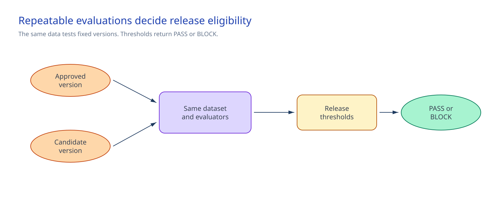

# Foundry evaluations and release quality gates

## Session scope

### What we will do

Create and run `release-gate.py` for fixed agent versions. Run the versioned golden data set
against the approved and candidate versions. The approved aggregate must return `PASS`. The
in-memory tool-process regression must return `BLOCK`.

### Why it matters

The gate answers one release question. It does not average away a failed tool path or safety metric.
Session 14 can run the same gate before promotion.

### Boundaries

Microsoft Foundry stores queries, responses, tool calls, evaluator reasons, and row-level results.
The approved release platform stores run aggregates and whether the gate is enabled or a version is
promoted. The repository stores the evaluation definitions, thresholds, and release policy used by
the gate.

The gate does not change the stable endpoint or promote an agent. Preview task-adherence,
prohibited-action, and sensitive-data-leakage evaluators stay advisory. Session 09 remains the
authorization boundary for prohibited writes.

## Architecture

### Architecture at a glance



The same synthetic data set evaluates two fixed versions. Foundry stores the detailed result. The
runner writes a payload-free aggregate to the approved external release store. The gate applies the
repository thresholds and release policy to those live inputs.

### Design choices and tradeoffs

| Decision | Chosen approach | Benefits | Costs and limitations | Revisit when |
|---|---|---|---|---|
| Test data | Versioned synthetic golden set. | Comparable runs. | Content changes need a new baseline. | Use cases or risks change. |
| Gate layers | Final-answer quality, tool process, and safety remain separate. | A strong average cannot hide a failure. | More than one owner maintains thresholds. | Evaluator behavior changes. |
| Protected material | Keep it blocking in East US 2. | Retains the approved safety check. | The run stops if the supported path is unavailable. | Regional support expands. |
| Operational state | Foundry retains live runs, and the release platform records whether the gate is enabled. | Avoids repository snapshots. | The gate reads external results. | The approved release platform changes. |

### Architecture guidance

Use the [cloud evaluation SDK guide](https://learn.microsoft.com/en-us/azure/foundry/how-to/develop/cloud-evaluation)
for evaluation runs and result handling. Use the
[agent evaluation guidance](https://learn.microsoft.com/en-us/azure/foundry/observability/how-to/evaluate-agent)
for exact agent-version targeting. Check the
[evaluation support guidance](https://learn.microsoft.com/en-us/azure/foundry/concepts/evaluation-regions-limits-virtual-network)
before each run.

## Before you start

Confirm these prerequisites:

- The approved and candidate versions are separate immutable versions of the Session 05 agent.
- The stable endpoint remains pinned to the approved version.
- The quality owner has confirmed current regional support, selected evaluators, and budget.
- Protected-material evaluation runs in East US 2 while it remains a blocking metric.
- The tool owner has approved tool-call evaluators for the supported Function Tool path, with no
  limited-support tool in the evaluated path.
- The operator and project managed identity have Foundry User on the exact project.
- The golden data set contains synthetic content only.

### Implementation files

| Type | File | Consumer |
|---|---|---|
| Runtime | [`artifacts/eval/evaluation-spec.json`](artifacts/eval/evaluation-spec.json) | The evaluation runner, release gate, preflight scripts, and Session 14 validators |
| Runtime | [`artifacts/eval/data/golden-v1.jsonl`](artifacts/eval/data/golden-v1.jsonl) | The evaluation runner and release gate |
| Deployment | [`artifacts/eval/thresholds.yaml`](artifacts/eval/thresholds.yaml) | The release gate, preflight scripts, and Session 14 validators |
| Deployment | [`artifacts/release/release-policy.json`](artifacts/release/release-policy.json) | The release owner, release gate, preflight scripts, and Session 14 promotion workflow |
| Record | [`artifacts/operations/disable-and-restore.md`](artifacts/operations/disable-and-restore.md) | The release owner and incident operator |

## Decisions and stop conditions

Set required configuration values through the approved delivery change path. Do not put project
endpoints, resource IDs, subscriptions, tokens, prompts, responses, tool payloads, or personal data
in the repository.

### Form the active thresholds

Before the baseline run, the quality owner approves the relevance floor, the tool owner approves
the tool-call accuracy and tool-call success floors, and the safety owner approves the safety
floors. Record those metric-specific floors in `thresholds.yaml`.

After the approved version completes, the control owners set each active blocking threshold from that
baseline. A
quality or tool threshold cannot be lower than its owner-approved floor or higher than the approved
baseline result. Safety floors and thresholds remain `1.00`. If an owner floor is higher than the
approved baseline result, the bounds conflict. Stop the gate; fix the approved version or change the
owner-approved floor through the delivery change path. Do not lower a floor to fit a weak baseline.

Record the approved baseline run ID and establishment date in the active threshold policy. The
release policy, threshold policy, and baseline aggregate must identify the same run.

### Fix the evaluated target and tool boundary

Evaluate two different immutable versions of the same agent in the approved nonproduction Foundry
project. The stable endpoint stays pinned to the approved version throughout both runs. The runner
targets the named version directly and does not call the stable selector.

This gate supports tool-process metrics for the approved Function Tool path. **Keep the gate disabled**
when a limited-support tool enters that path, including Azure AI Search, Bing Grounding, Bing Custom
Search, SharePoint Grounding, Code Interpreter, Fabric Data Agent, or Web Search. The tool owner
must approve compatibility again before tool-process metrics can block a release.

### Check the current regional and evaluator boundary

Before every run, the quality owner checks the current Microsoft support matrix for batch
evaluation, the selected risk and safety evaluators, and protected-material evaluation. Record this
same-day manual support check through the release policy; no stable support-discovery API is assumed.

Protected material remains a blocking safety metric in East US 2. If the selected region cannot run
it, stop. Move the complete gate to East US 2, or have the safety and release owners revise the
policy through the approved delivery path before another run. For an isolated project, also confirm
evaluation subnet delegation and the project managed identity's **Foundry User** assignment.

Preview task-adherence, prohibited-action, and sensitive-data-leakage evaluators remain advisory.
They cannot become the sole blocking control.

### Apply zero-error and exception rules

The gate returns `PASS` for the candidate **only when every blocking metric is present, meets its
active threshold, and has zero evaluator errors**. Final-answer quality, tool process, and safety are
separate blocking layers; a passing result in one layer cannot offset a failure in another.

An exception can address an eligible non-safety quality failure. It must name the failed metric and
business reason, define a compensating control, name its owner and exception authority, and include
an expiry. It cannot override a safety or tool-process failure and cannot enable automatic
promotion.

### Assign the release decision

The quality owner maintains the golden data, evaluator selection, and threshold history. The safety
owner owns safety coverage, the protected-material region, and preview-evaluator boundaries. The
tool owner owns Function Tool compatibility and tool-process remediation. The cost owner approves
evaluation consumption. The release owner records gate state and controls the stable version
selector.

Stop when an agent version is implicit or mutable, the project or region is outside scope, a preview
evaluator becomes blocking, a limited-support tool enters the evaluated path, a safety or
tool-process failure is treated as overridable, or a current result would be written under this
repository.

When evaluators, tools, or thresholds change, the release owner updates the version-controlled
policy. Foundry and the release platform record support checks, run IDs, gate state, and release
decisions.

## Implement

### 1. Set runtime context

Complete the shared Execution environment setup in the root README before this step. Sign in to
Azure CLI for the approved subscription and install the required Python dependencies. Then keep the
current resource coordinates and external release-store path in the shell:

```powershell
$approvedSubscriptionId = $env:AZURE_SUBSCRIPTION_ID
$env:FOUNDRY_RESOURCE_ID = $env:APPROVED_FOUNDRY_RESOURCE_ID
$env:FOUNDRY_PROJECT_ENDPOINT = $env:APPROVED_FOUNDRY_PROJECT_ENDPOINT
$env:FOUNDRY_MODEL_NAME = $env:APPROVED_EVALUATION_MODEL
$releaseStore = $env:APPROVED_RELEASE_STORE
```

```bash
approved_subscription_id="${AZURE_SUBSCRIPTION_ID:?Set AZURE_SUBSCRIPTION_ID.}"
export FOUNDRY_RESOURCE_ID="${APPROVED_FOUNDRY_RESOURCE_ID:?Set APPROVED_FOUNDRY_RESOURCE_ID.}"
export FOUNDRY_PROJECT_ENDPOINT="${APPROVED_FOUNDRY_PROJECT_ENDPOINT:?Set APPROVED_FOUNDRY_PROJECT_ENDPOINT.}"
export FOUNDRY_MODEL_NAME="${APPROVED_EVALUATION_MODEL:?Set APPROVED_EVALUATION_MODEL.}"
release_store="${APPROVED_RELEASE_STORE:?Set APPROVED_RELEASE_STORE outside this repository.}"
```

### 2. Run the preflight

```powershell
.\scripts\preflight.ps1 `
  -ApprovedSubscriptionId $approvedSubscriptionId `
  -Phase Baseline
```

```bash
./scripts/preflight.sh \
  --approved-subscription-id "$approved_subscription_id" \
  --phase baseline
```

Preflight resolves the exact Foundry targets and checks configuration before the billable run. The
Evals API has no dry run.

### 3. Run the approved version and set thresholds

```powershell
python .\scripts\run-evaluation.py `
  --spec .\artifacts\eval\evaluation-spec.json `
  --target approved `
  --output (Join-Path $releaseStore "approved-baseline.json")
```

```bash
python ./scripts/run-evaluation.py \
  --spec ./artifacts/eval/evaluation-spec.json \
  --target approved \
  --output "$release_store/approved-baseline.json"
```

Inspect row-level detail in Foundry. The release owner and control owners set active thresholds from
the approved result through the delivery change path, following the floor and baseline bounds above.
Foundry and the release platform retain the current baseline run ID and approval.

### 4. Run and gate the candidate version

```powershell
.\scripts\preflight.ps1 `
  -ApprovedSubscriptionId $approvedSubscriptionId `
  -Phase Candidate

python .\scripts\run-evaluation.py `
  --spec .\artifacts\eval\evaluation-spec.json `
  --target candidate `
  --output (Join-Path $releaseStore "candidate.json")

python .\scripts\release-gate.py `
  --policy .\artifacts\eval\thresholds.yaml `
  --spec .\artifacts\eval\evaluation-spec.json `
  --dataset .\artifacts\eval\data\golden-v1.jsonl `
  --baseline-result (Join-Path $releaseStore "approved-baseline.json") `
  --candidate-result (Join-Path $releaseStore "candidate.json") `
  --evaluated-target candidate `
  --expect pass
```

```bash
./scripts/preflight.sh \
  --approved-subscription-id "$approved_subscription_id" \
  --phase candidate

python ./scripts/run-evaluation.py \
  --spec ./artifacts/eval/evaluation-spec.json \
  --target candidate \
  --output "$release_store/candidate.json"

python ./scripts/release-gate.py \
  --policy ./artifacts/eval/thresholds.yaml \
  --spec ./artifacts/eval/evaluation-spec.json \
  --dataset ./artifacts/eval/data/golden-v1.jsonl \
  --baseline-result "$release_store/approved-baseline.json" \
  --candidate-result "$release_store/candidate.json" \
  --evaluated-target candidate \
  --expect pass
```

`PASS` makes the fixed candidate eligible for the approved delivery path. It does not move the
stable selector or promote the candidate. `BLOCK` leaves the stable selector on the approved
version; remediate the failed layer and evaluate a new fixed candidate version.

## Confirm the result

### Intended path

Run the gate against the approved aggregate as both inputs. It returns `PASS` when every
blocking metric is present, has zero errors, and meets its active threshold. Confirm that the
result reports separate final-answer quality, tool-process, and safety summaries rather than one
blended score.

### Blocked or failure path

```powershell
python .\scripts\test_release_gate.py --mode blocked-tool-process
```

```bash
python ./scripts/test_release_gate.py --mode blocked-tool-process
```

The in-memory test returns `BLOCK` for tool-call accuracy and tool-call success while final-answer
quality and safety remain passing.

### Delivery-owner checkpoint

The release owner sees both gate outcomes and the candidate result in the approved release
platform. A blocked candidate stays unpinned. An enabled delivery integration may make a passing
candidate eligible for Session 14, but it does not promote the version.

## After implementation

Keep the golden data, evaluation specification, threshold policy, release policy, scripts, and
disable-and-restore runbook in operation. Foundry and the release platform retain run and decision
records. The quality owner maintains the data and thresholds. The safety owner defines the safety
boundary. The tool owner maintains tool-process compatibility, and the release owner controls the
stable selector and delivery integration.

Use [`artifacts/operations/disable-and-restore.md`](artifacts/operations/disable-and-restore.md) to
keep or restore the approved version, remove delivery integration after dependency review, and
cancel unnecessary evaluations. The scripts never change the stable endpoint or delete cloud state.
