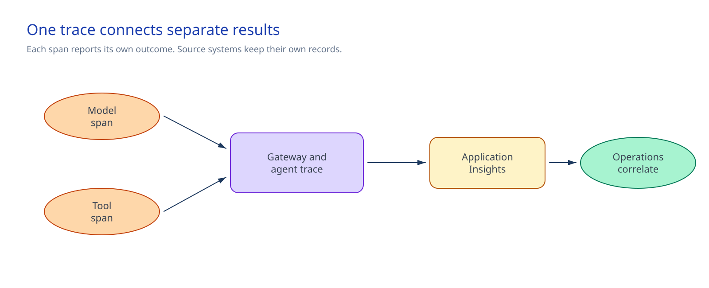

# Implement observability, cost, and operational controls

## Session scope

### What we will do

**Objective.** Give operators a way to find a failing request, and its cost and security context,
without collecting prompt or tool content.

Deploy a workbook, three alert rules, and a subscription budget for one governed service, and keep
the telemetry, retention, and incident definitions that keep it operating. Session 12's promotion
workflow runs the paired Session 11 smoke check against this deployment and gets one payload-free
pass or fail result.

### Why it matters

**Problem.** A gateway, agent, model, or tool failure looks the same from outside the system, and a
cost or security signal can go unnoticed until it's already an incident.

**Solution.** Joined runtime spans separate where a request failed, alerts route the signal to an
owner, and the budget and runbook give the cost and incident owners a working signal, all without
capturing prompts or tool payloads.

### Boundaries

Application Insights stays authoritative for runtime telemetry, Cost Management for billed cost,
and Defender and the SOC system for security and incident records. Standard telemetry excludes
prompts, responses, tool payloads, credentials, and personal data; APIM token metrics only estimate
usage, and a budget notifies rather than stops resources.

Production content logging and user-level cost allocation stay outside this session's default scope
and need separate approval. Session 12's promotion workflow consumes the paired smoke check's
payload-free result before it promotes a release.

## Architecture

### Architecture at a glance



The approved request carries W3C trace context through API Management, the agent, the model, and
the tool. One non-sensitive correlation ID joins the supported spans, while each span keeps its own
result. A tool failure must not become a model failure.

The workbook and alert queries read Application Insights. APIM emits bounded token metrics for a
faster usage estimate. Cost Management reports the bill later. The customer-owned APIM repository
remains authoritative for gateway policy, and the Session 12 workflow consumes the temporary smoke
result.

### Design choices and tradeoffs

| Decision | Chosen approach | Benefit | Limit |
|---|---|---|---|
| Runtime content | Exclude prompts, responses, and tool payloads by default | Trace service behavior without creating a content archive | A diagnostic exception needs separate, time-limited approval |
| Trace volume | Sample at the source, preserve selected traces end to end, and do not sample metrics | Bound ingestion while keeping joined traces | Sampling can miss rare failures |
| Cost signal | Use low-cardinality APIM token metrics for estimates and Cost Management for billing | Give operators a fast signal without treating it as an invoice | Counts can be incomplete; billing normally lags 8-24 hours |

### Architecture guidance

- [Trace agent overview](https://learn.microsoft.com/en-us/azure/foundry/observability/concepts/trace-agent-concept)
- [Sampling in Azure Application Insights with OpenTelemetry](https://learn.microsoft.com/en-us/azure/azure-monitor/app/opentelemetry-sampling)
- [Create and manage budgets](https://learn.microsoft.com/en-us/azure/cost-management-billing/costs/tutorial-acm-create-budgets)

## Before you start

Confirm these requirements:

- An approved governed runtime can be inspected: the platform owner identifies the immutable agent
  and project, the gateway owner identifies the versioned APIM policy and tool path, the quality
  owner can retrieve the current evaluation result, and the security owner can retrieve the payload-free
  adversarial result and Defender route check. (Sessions 04, 06, and 08-11.)
- The Session 04 nonproduction policy assistant and Session 06 APIM route support an approved
  read-only request and a separate handled failure for a nonexistent synthetic policy.
- A workspace-based Application Insights component, its Log Analytics workspace, an action group,
  and an approved retention boundary exist.
- Application instrumentation is deployed. The customer-owned APIM policy already preserves W3C
  context and emits bounded token metrics.
- The Foundry agent type is recorded. Prompt and hosted agent tracing is generally available.
  Workflow and external agent tracing remains preview and requires an approved nonproduction
  preview-use decision.
- Baseline telemetry has been reviewed before owners set alert thresholds.
- The observability, application, gateway, tool, AI quality, security operations, data-protection,
  cost, and service owners can make their required decisions.

When prerequisite sessions were implemented elsewhere, verify:

| Control | Required state | Owner check |
|---|---|---|
| Runtime | The deployment record names the Foundry project, immutable agent version, Microsoft Entra agent identity, network path, versioned APIM policy, tool identities and scopes, and data-policy assignment | Platform, gateway, tool, and data owners confirm that one approved read-only request reaches the listed backend and tool |
| Tracing | OpenTelemetry and APIM propagate W3C `traceparent` and one non-sensitive correlation ID | Observability owner finds joined gateway, agent, model, and tool spans with separate results |
| Evaluation | The evaluation definition, threshold policy, and approved aggregate result name the deployed version | AI quality owner gets the recorded pass or block result from the release gate |
| Security | The payload-free adversarial summary, Defender onboarding state, and security-event route name the protected version | Security operations finds blocked prohibited actions and one expected signal in the listed Defender or SOC record |

The deployment operator needs:

- **Monitoring Contributor** at the exact deployment resource-group scope;
- **Log Analytics Reader** at the exact workspace scope;
- **Monitoring Reader** at the exact Application Insights and action-group resource scopes when
  either resource is outside the deployment group; and
- **Cost Management Contributor** at the exact subscription scope.

Human access lasts through preflight, deployment, and confirmation. Remove or expire it through the
approved access process afterward.

### Implementation files

| Type | File | Consumer |
|---|---|---|
| Runtime | [`artifacts/telemetry/telemetry-contract.json`](artifacts/telemetry/telemetry-contract.json) | Application developers, the observability owner, and preflight scripts |
| Deployment | [`artifacts/infra/main.bicep`](artifacts/infra/main.bicep) | The Azure deployment pipeline |
| Deployment | [`artifacts/infra/main.bicepparam`](artifacts/infra/main.bicepparam) | The Azure deployment pipeline |
| Deployment | [`artifacts/monitoring/workbook.json`](artifacts/monitoring/workbook.json) | Operators and the workbook deployment |
| Runtime | [`artifacts/queries/request-error-rate-alert.kql`](artifacts/queries/request-error-rate-alert.kql) | The request-error scheduled-query alert |
| Runtime | [`artifacts/queries/tool-failure-alert.kql`](artifacts/queries/tool-failure-alert.kql) | The tool-failure scheduled-query alert |
| Runtime | [`artifacts/queries/quality-safety-alert.kql`](artifacts/queries/quality-safety-alert.kql) | The quality and safety scheduled-query alert |
| Deployment | [`artifacts/cost/budget.bicep`](artifacts/cost/budget.bicep) | The subscription deployment pipeline and cost owner |
| Deployment | [`artifacts/cost/budget.bicepparam`](artifacts/cost/budget.bicepparam) | The subscription deployment pipeline |
| Record | [`artifacts/cost/cost-allocation.md`](artifacts/cost/cost-allocation.md) | The cost owner |
| Record | [`artifacts/governance/data-retention-decision.md`](artifacts/governance/data-retention-decision.md) | The observability owner |
| Record | [`artifacts/governance/prompt-response-logging-decision.md`](artifacts/governance/prompt-response-logging-decision.md) | The privacy and observability owners |
| Record | [`artifacts/operations/incident-runbook.md`](artifacts/operations/incident-runbook.md) | The incident commander and service operators |

## Decisions and stop conditions

Resolve every `__REQUIRED_*__` value before a state change. Use team aliases, not personal data.
Keep subscription IDs, resource IDs, endpoints, credentials, connection strings, and customer data
out of source control.

| Gate | Continue when | Stop when |
|---|---|---|
| Scope | Azure CLI targets the approved nonproduction subscription, deployment group, Application Insights component, workspace, action group, and budget scope | Any target is production, shared without approval, or outside the recorded scope |
| Telemetry | W3C context is continuous, correlation is non-sensitive, and gateway, agent, model, and tool results remain separate | A hop is missing, a field carries sensitive data, or a dimension is unbounded |
| Privacy | Filtering and redaction happen before export; standard content logging is disabled | Content capture is the default, cannot be filtered before export, or an exception lacks purpose, scope, owner, retention, expiry, and data-protection approval |
| Sampling | Metrics remain unsampled; approved error and security signals bypass normal trace sampling | The sampler breaks complete selected traces or a daily cap is treated as normal control |
| Alerts and cost | Thresholds come from baseline telemetry and approved SLOs; dimensions stay within APIM's limit of five custom dimensions, 100 values each, and 1,000 active series per metric | A threshold lacks an owner, dimensions contain users or free text, or a budget is presented as spend enforcement |
| External export | Export is disabled, or the customer records the destination, owner, payload filter, and restore reference | A SIEM route receives prompts, responses, credentials, personal data, or an unowned event stream |
| Preview | Both Bicep what-if results contain only the workbook, three alerts, and exact budget | A preview replaces unrelated resources, removes an action route, or targets the wrong subscription |

The gateway owner changes the APIM policy through its own repository. Do not replace an API-scope
policy that contains Session 06 authentication, safety, routing, quota, token-limit, rate-limit, or
backend controls.

## Implement

### 1. Complete the retained decisions

Complete the telemetry contract, deployment parameters, budget parameters, retention decision,
content-logging decision, cost-allocation record, and incident runbook. Keep the service name
consistent across machine-readable files.

Leave `externalExport.enabled` set to `false` when the customer keeps telemetry in Azure Monitor.
When export is required, record the destination type, stable alias, owner, and restore reference.
The export pipeline must remove every prohibited attribute before Azure Event Hubs or another
customer transport sends the event.

For a disabled content-logging exception, set its detail fields to `N/A`. An approved exception
needs a bounded purpose, isolated scope, access owner, retention, expiry, and data-protection
approval.

Set the deployment coordinates:

```powershell
$approvedSubscriptionId = $env:AZURE_SUBSCRIPTION_ID
$approvedResourceGroupName = $env:OBSERVABILITY_RESOURCE_GROUP
$approvedApplicationInsightsResourceId = $env:APPLICATION_INSIGHTS_RESOURCE_ID
$deploymentLocation = $env:AZURE_DEPLOYMENT_LOCATION
```

```bash
approved_subscription_id="${AZURE_SUBSCRIPTION_ID}"
approved_resource_group_name="${OBSERVABILITY_RESOURCE_GROUP}"
approved_application_insights_resource_id="${APPLICATION_INSIGHTS_RESOURCE_ID}"
deployment_location="${AZURE_DEPLOYMENT_LOCATION}"
```

### 2. Confirm the pre-work

The application uses the supported Azure Monitor OpenTelemetry distro for its language and receives
the Application Insights connection string through the deployment environment. It emits separate
agent, model, tool, evaluation, and security signals; propagates `traceparent` and
`x-correlation-id`; and drops prohibited attributes before export.

The customer-owned APIM policy preserves the Session 06 controls, trace context, and bounded token
metrics. Do not use user, email, request, correlation, prompt, response, or free-text values as
metric dimensions.

### 3. Run preflight

```powershell
.\scripts\preflight.ps1 `
  -ApprovedSubscriptionId $approvedSubscriptionId `
  -ApprovedResourceGroupName $approvedResourceGroupName `
  -ApprovedApplicationInsightsResourceId $approvedApplicationInsightsResourceId `
  -DeploymentLocation $deploymentLocation
```

```bash
./scripts/preflight.sh \
  --approved-subscription-id "$approved_subscription_id" \
  --approved-resource-group-name "$approved_resource_group_name" \
  --approved-application-insights-resource-id "$approved_application_insights_resource_id" \
  --deployment-location "$deployment_location"
```

Preflight checks every required decision, artifact syntax, telemetry privacy and cardinality,
resource binding, both Bicep templates, and the resource-group and subscription what-if previews.

### 4. Deploy the workbook, alerts, and budget

After the observability and cost owners approve both previews:

```powershell
az deployment group create `
  --subscription $approvedSubscriptionId `
  --resource-group $approvedResourceGroupName `
  --template-file .\artifacts\infra\main.bicep `
  --parameters .\artifacts\infra\main.bicepparam

az deployment sub create `
  --subscription $approvedSubscriptionId `
  --location $deploymentLocation `
  --template-file .\artifacts\cost\budget.bicep `
  --parameters .\artifacts\cost\budget.bicepparam
```

```bash
az deployment group create \
  --subscription "$approved_subscription_id" \
  --resource-group "$approved_resource_group_name" \
  --template-file ./artifacts/infra/main.bicep \
  --parameters ./artifacts/infra/main.bicepparam

az deployment sub create \
  --subscription "$approved_subscription_id" \
  --location "$deployment_location" \
  --template-file ./artifacts/cost/budget.bicep \
  --parameters ./artifacts/cost/budget.bicepparam
```

Open the workbook. Run the request-error and tool-failure queries over their 15-minute windows and
the quality query over its 30-minute window. Each query must parse and return its expected result
column, even when the count is zero. The action-group owner uses the existing authorized test path
to confirm delivery. Do not generate unsafe traffic to force an alert.

## Confirm the result

Run the paired smoke check from the Session 12 GitHub promotion workflow. The normal and handled
failure routes must be different HTTPS endpoints. The scripts resolve the live Application Insights
workspace before either request and reject a result path outside `RUNNER_TEMP`.

```powershell
$env:session12_SMOKE_URL = $env:APPROVED_SYNTHETIC_SMOKE_URL
$env:session12_SMOKE_FAILURE_URL = $env:APPROVED_SYNTHETIC_FAILURE_URL
$env:session12_AI_RESOURCE_ID = $env:APPROVED_APPLICATION_INSIGHTS_RESOURCE_ID
$env:session12_LOG_ANALYTICS_WORKSPACE_ID = $env:APPROVED_LOG_ANALYTICS_WORKSPACE_ID
$env:session12_SMOKE_BEARER_TOKEN = $env:APPROVED_SYNTHETIC_SMOKE_TOKEN
$env:session12_SMOKE_TIMEOUT_SECONDS = "180"
$env:session12_SMOKE_RETRY_SECONDS = "15"
$resultPath = Join-Path $env:RUNNER_TEMP "session11-smoke.json"

.\scripts\smoke.ps1 `
  -Mode Pipeline `
  -Environment nonproduction `
  -CommitSha $env:RELEASE_COMMIT_SHA `
  -ResultPath $resultPath
```

```bash
export session12_SMOKE_URL="${APPROVED_SYNTHETIC_SMOKE_URL}"
export session12_SMOKE_FAILURE_URL="${APPROVED_SYNTHETIC_FAILURE_URL}"
export session12_AI_RESOURCE_ID="${APPROVED_APPLICATION_INSIGHTS_RESOURCE_ID}"
export session12_LOG_ANALYTICS_WORKSPACE_ID="${APPROVED_LOG_ANALYTICS_WORKSPACE_ID}"
export session12_SMOKE_BEARER_TOKEN="${APPROVED_SYNTHETIC_SMOKE_TOKEN}"
export session12_SMOKE_TIMEOUT_SECONDS="180"
export session12_SMOKE_RETRY_SECONDS="15"
result_path="${RUNNER_TEMP}/session11-smoke.json"

./scripts/smoke.sh \
  --mode pipeline \
  --environment nonproduction \
  --commit-sha "${RELEASE_COMMIT_SHA}" \
  --result-path "$result_path"
```

The scripts discard response bodies and keep only safe correlation IDs. They poll Application
Insights until the normal and failure traces are complete and three consecutive queries have the
same counts and latest `TimeGenerated` value. The default wait is 180 seconds with a 15-second
retry.

The result must show:

- `status: passed`, the exact release commit SHA on both request records, and the live workspace
  binding;
- successful model and tool results for the normal route;
- a failed tool dependency and independent successful model result for the failure route;
- distinct safe correlation IDs, stable ingestion, and `telemetryPollTimedOut: false`;
- the expected request, error, latency, model, token, agent, tool, and quality fields; and
- no probe marker or prohibited payload property in requests, dependencies, events, traces, or
  exceptions.

Stop on a missing hop, matching correlation IDs, commit mismatch, unstable ingestion, workspace
mismatch, sensitive content, or a tool failure without an independent model result. Do not weaken
redaction to make a trace complete.

## After implementation

| Owner | What remains |
|---|---|
| Service owner | SLO and service operating decision |
| Observability owner | Instrumentation, sampling, retention, workbook, and alerts |
| Gateway owner | APIM correlation and token metrics in the customer policy repository |
| Tool owner | Tool-span accuracy and independent authorization |
| AI quality owner | Evaluation signals and thresholds |
| Security operations | Security-event routing and incident handling |
| Cost owner | Tags, budget thresholds, and reconciliation with billed cost |
| Incident commander | Containment and recovery decisions |

Run the control against the approved nonproduction service. Session 12 calls `smoke.ps1` or
`smoke.sh` with the fixed pipeline mode, environment, commit SHA, runtime inputs, and runner-temporary
result path.

Restore through the owning change paths:

1. Route the application to the last approved Session 04 version if instrumentation causes a fault.
2. Restore the previous Session 06 APIM policy without removing authentication, safety, routing,
   quota, token-limit, rate-limit, or backend controls.
3. Disable only the noisy Session 11 alert rules while correcting their queries or thresholds.
4. Remove only resources listed in the approved Session 11 what-if and tagged
   `implementationSession=11-observability-cost-operations`.
5. Delete the exact Session 11 budget only after the cost owner confirms that no workflow uses it.
6. Keep records required by an active incident, legal hold, or retention obligation.

Do not disable telemetry, Defender, or SOC routing to silence a real signal.
