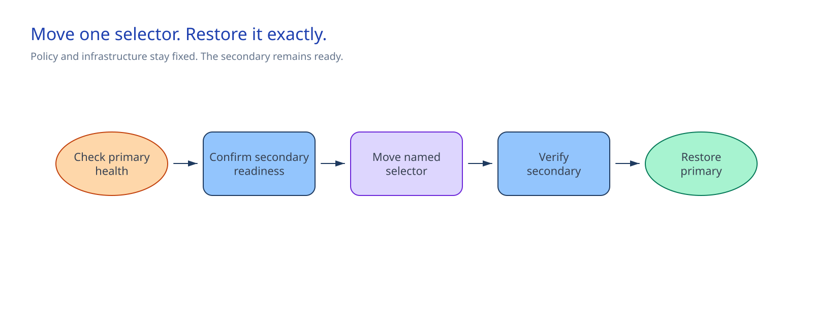

<!-- _class: cover -->

AI Governance Co-implementation · Session 13

# Regional failover rehearsal for a governed AI service

180 minutes · Move one approved selector to the secondary path, then restore it

<!-- Notes: The service already has both regional paths. -->

---

## Why it matters

> Operators must be able to move traffic to the secondary path and return it safely.

By the end of the session:

- Confirm that the primary path is active and that the secondary path is ready.
- Preview each selector move before it changes traffic.
- Check the secondary path against the regional contract.
- Restore and check the primary path.

<!-- Notes: The check covers one governed service. It does not deploy or promote anything. -->

---

<!-- _class: two-column -->

## Architecture and boundary

The regional contract names both selectors and the expected path values.

The health control checks the active path. The routing control previews and changes one selector.

The customer change record holds approval and the outcome.

Session 12 remains the path for infrastructure and policy promotion.

<!-- Notes: Foundry, API Management, and Azure Monitor remain authoritative for live service state. -->

---

<!-- _class: decision -->

## Implementation tradeoffs

| Decision | Required answer |
|---|---|
| Scope | Exact resource group, change record, maintenance window, delivery owner, and restore owner |
| Selectors | Different primary and secondary traffic selectors |
| Expected path | Agent version, Entra identity, API Management policy version, endpoint, and trace fields |
| Customer controls | Paired PowerShell and Bash health and routing controls with documented parameters |

**Keep the current selector while any answer is missing.**

<!-- Notes: The routing control must expose Preview, Failover, and Restore, and must change only the named selector. -->

---

<!-- _class: implementation -->

## Implementation path

**Total session: 180 minutes. Guided work: about 120 minutes.**

1. Complete the scope, selector, expected-value, and owner entries.
2. Run decision preflight.
3. Check the active primary path.
4. Check secondary readiness and preview the primary-to-secondary move.
5. Get delivery-owner approval, move the selector, and check the secondary path.
6. Preview the return move, restore the primary selector, and check the primary path.

Reserve time for the briefing, approvals, and handoff.

<!-- Notes: The team cannot use the maintenance window to resolve missing access or path details. -->

---

## Access and safety gates

| Gate | Continue when | Stop when |
|---|---|---|
| Scope | The requested scope matches the control definition and change record | It reaches an unapproved resource group |
| Primary path | Active health output matches the regional contract | A required value, endpoint, or trace field differs |
| Move | The routing preview passes and the delivery owner approves | Approval or the maintenance window is unavailable |
| Restore | The return preview passes and the delivery owner approves | The secondary check fails or the restore path is not ready |

Health output stays outside the repository. The wrappers remove it after each check.

<!-- Notes: If the secondary check fails after traffic moves, stop and use the approved restore path. -->

---

<!-- _class: implementation -->

## Rehearse and restore

1. Freeze infrastructure and API Management policy changes.
2. Check secondary readiness with the approved health control.
3. Preview the selector move. Get delivery-owner approval.
4. Move the selector. Check the secondary path.
5. Preview the return. Get delivery-owner approval again.
6. Restore the primary selector. Check the primary path.

Only the routing control moves traffic.

<!-- Notes: The wrapper checks agent version, Entra identity, policy version, endpoint, required trace fields, and sensitiveInputPresent. -->

---

<!-- _class: two-column -->

## Confirm and operate

### Confirm once

The wrapper reports matching secondary and restored-primary paths. Both report
`sensitiveInputPresent: false`.

### After the rehearsal

The service continuity owner maintains the runbook. The platform owner maintains the regional
contract. The routing owner maintains the controls.

Keep the secondary path deployed. End temporary access through the customer process.

<!-- Notes: Record the outcome in the approved change record. -->

---

<!-- _class: closing -->

# Thank you!
