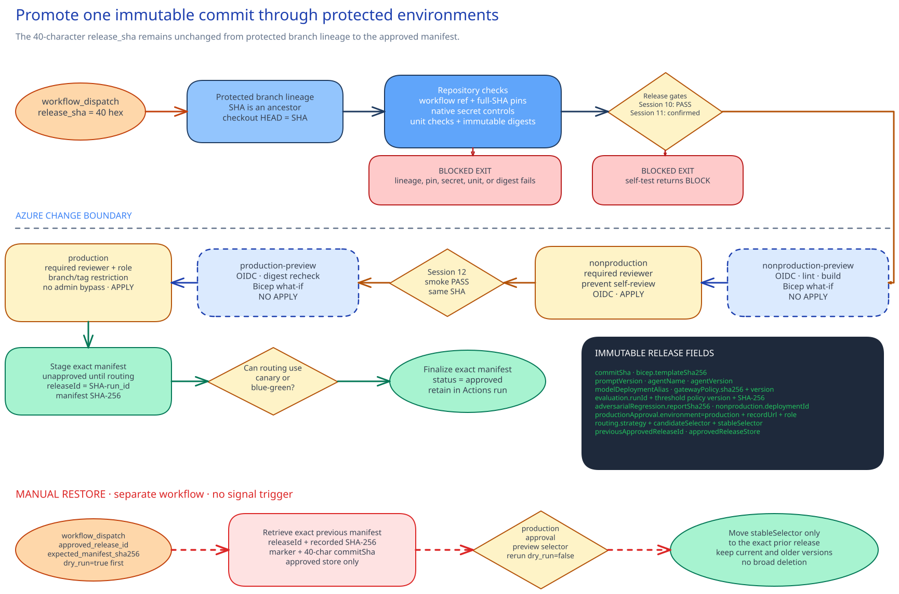

# Implementation - CI/CD, policy as code, and controlled promotion

## Session scope

### What we will do

Promote **one immutable, gate-passing release** through protected nonproduction and production
environments. An authorized operator supplies `workflow_dispatch.release_sha`; the workflow proves
that SHA is reachable from the protected default branch before release content runs. The same SHA
then binds approval, both deployments, routing, the approved manifest, and the manual restore
reference.

### Why it matters

A release is safe to promote only when its code, AI configuration, gate results, deployment
approvals, and traffic change still describe the same immutable unit. The workflow makes that
relationship inspectable and stops Session 11's known tool-process regression before any Azure
preview or approval.

### Boundaries

GitHub Actions and the four protected GitHub environments own the promotion sequence. Microsoft
Entra owns the environment-scoped workload identities, Azure Resource Manager owns deployment
state, and API Management owns the selected route. Foundry, Application Insights, Defender, and the
approved release store remain authoritative for their linked gate, telemetry, security, and
manifest records.

The workflow uses the existing [Session 06](../../06-governed-agent-baseline/implementation/README.md)
agent and [Session 07](../../07-apim-ai-gateway/implementation/README.md) routing path. It does not
create another delivery platform or make routing available where the current platform lacks a safe
preview and restore path. Session 11 creates the callable eligibility gate; this session makes
promotion depend on it. Session 15 may consume the protected release path for its approved
secondary deployment.

## Architecture

### Architecture at a glance



The full commit SHA, the exact identifier for one Git commit, is the release's identity. The
protected workflow carries it through every check, preview, approval, deployment, route change, and
manifest entry. Fixed component digests, which are cryptographic fingerprints of the other release
parts, bind those parts to the same release. If anything changes between stages, the team creates a
new release instead of quietly promoting a different unit.

The workflow makes decisions before it changes Azure. It first proves that the SHA is reachable
from the protected default branch. Unit checks then run alongside the evaluation, adversarial, and
observability gates supplied by Sessions 11-13. Any failed gate ends the run before the Azure change
boundary.

Preview and apply use different GitHub environments. A preview job presents its exact OIDC subject,
the identity string for that repository and environment, to obtain an environment-scoped Microsoft
Entra workload identity. It then runs Bicep what-if. The apply environments withhold their own
credentials until a reviewer approves the preview. Azure Resource Manager deploys the same
release, and API Management moves the approved selector only after both deployments pass.

Each decision stays with the system that made it. GitHub records workflow execution and environment
approvals. Microsoft Entra holds workload trust. Azure Resource Manager reports deployed state,
and API Management reports routing. The finalized manifest belongs in the approved release store;
it links these records instead of copying them.

The workflow controls only changes made through this promotion path. Manual restore follows a
separate, production-approved workflow. It reads the previous approved manifest, checks the target
release, and returns the stable selector to that release. Session 15 uses this protected path to
deploy an approved secondary region.

[`artifacts/github/promotion.yml`](artifacts/github/promotion.yml) implements the promotion path.
[`artifacts/github/restore-previous-release.yml`](artifacts/github/restore-previous-release.yml)
implements restore. Both use the fixed fields in
[`artifacts/pipeline/release-manifest.template.json`](artifacts/pipeline/release-manifest.template.json)
to identify the release.

### Design choices and tradeoffs

| Decision | Chosen approach | Why this shape helps | What it requires | Revisit when |
|---|---|---|---|---|
| Release identity | Bind checkout and every later gate to one full commit SHA and fixed component digests. Deployment, routing, and the manifest use the same identity. | A mismatch exposes stage drift, and restore can name one exact release. | A corrected component requires a new release. Mutable aliases cannot be promoted. | The repository boundary changes or the team defines a different release unit. |
| Preview and apply access | Use separate protected preview and apply environments, each with an exact OIDC subject. | What-if runs before approval. Apply credentials remain unavailable until the protection rules pass. | Four environment subjects and their protections must stay aligned with Microsoft Entra. | GitHub changes its subject format, plan features, or environment model. |
| Recovery | Restore the previous release through a manual, production-approved workflow. | An owner checks the target manifest and route before production traffic moves. | Restore authority must be available. Recovery is slower than automatic rollback. | A tested automatic policy can perform the same identity and manifest checks, then verify health and routing. |

### Architecture guidance

- [Authenticate to Azure from GitHub Actions by OpenID Connect](https://learn.microsoft.com/en-us/azure/developer/github/connect-from-azure-openid-connect)
  covers Microsoft Entra workload identity federation without a client secret.
- [ARM template deployment what-if operation](https://learn.microsoft.com/en-us/azure/azure-resource-manager/templates/deploy-what-if)
  explains preview behavior and required resource operations.
- [Azure built-in roles for Privileged](https://learn.microsoft.com/en-us/azure/role-based-access-control/built-in-roles/privileged)
  defines the Contributor boundary used by the stage identities.

## Before you start

1. Work from the exact customer repository. Keep the reviewed workflow on the protected default
   branch, and record the approved 40-character release SHA in the customer's change system. The
   SHA must be reachable from that branch. The release commit itself must not store the SHA.
2. Complete Sessions 06, 07, 11, 12, and 13. A focused route may use the substitute baseline
   below, but every row must pass before the workflow is installed.
3. Confirm the approved [Session 11](../../11-foundry-evaluations-quality-gates/implementation/README.md) threshold policy, release policy, baseline record, and passing candidate record are usable by the callable
   `sessions/11-foundry-evaluations-quality-gates/implementation/scripts/release-gate.py`.
   The schema-version 2 release policy must have `gate.state=enabled`,
   `gate.decision=approved`, a valid `gate.decisionDate`, the exact activation contract, and
   `requiredEnforcementOption=--require-enabled`. Its baseline and candidate run IDs must match the
   threshold policy and records. Session 11 supplies the gate and its PASS/BLOCK contract. Its stable blocked check is
   `python sessions/11-foundry-evaluations-quality-gates/implementation/scripts/test_release_gate.py
   --mode blocked-tool-process`. This workflow enforces both calls.
4. Confirm
   `sessions/12-red-teaming-threat-defense/implementation/artifacts/reports/before-after-report.json`
   has status `confirmed`, names distinct baseline and post-remediation versions, and binds the
   post-remediation version to the immutable release. The matching
   `artifacts/governance/risk-change-handoff.json` must name the same agent and versions. The report
   uses one configuration hash, records lower overall attack success, passes each complete per-risk
   row, records prohibited actions at zero attack success, and sets every payload flag, including
   `containsEvaluatorReasons`, to `false`.
   `socDelivery.status` is a
   separate operational result and does not prove the red-team comparison. `pending-runs` or any
   failed comparison stops promotion.
5. Use the operational [Session 13](../../13-observability-cost-operations/implementation/README.md)
   smoke executables with their fixed interfaces:

   ```powershell
   ..\..\13-observability-cost-operations\implementation\scripts\smoke.ps1 `
     -Mode Pipeline `
     -Environment nonproduction `
     -CommitSha <40-character-sha> `
     -ResultPath <runner-temporary-json-path>
   ```
   ```bash
   ../../13-observability-cost-operations/implementation/scripts/smoke.sh \
     --mode pipeline \
     --environment nonproduction \
     --commit-sha <40-character-sha> \
     --result-path <runner-temporary-json-path>
   ```

   Its JSON result must use `implementationSession:
   13-observability-cost-operations`, target the same `commitSha`, have status `passed`, mark
   `syntheticRequest`, `endToEndTrace`, and `toolAndModelFailureSeparated` as `passed`, set
   `sensitiveInputPresent` and `payloadsRetained` to `false`, and include distinct lower-case W3C
   trace IDs for the normal and expected-failure requests. The root `correlationId` must equal the
   normal trace ID. The result must also show stable telemetry ingestion, no polling timeout, a
   bounded attempt count of at least three, a timeout from 30 to 600 seconds, and a retry interval
   from 5 to 60 seconds. The timeout must allow at least two retry intervals.
   The protected `nonproduction` environment provides `SESSION13_SMOKE_URL`,
   `SESSION13_SMOKE_FAILURE_URL`, `SESSION13_AI_RESOURCE_ID`,
   `SESSION13_LOG_ANALYTICS_WORKSPACE_ID`. Store `SESSION13_SMOKE_BEARER_TOKEN` as an environment
   secret. Optional `SESSION13_SMOKE_TIMEOUT_SECONDS` and `SESSION13_SMOKE_RETRY_SECONDS` variables
   override the 180-second and 15-second defaults. Session 13 owns the polling loop; Session 14
   invokes it and requires `checks.telemetryPollTimedOut=false`,
   `checks.releaseCommitShaVerified=true`, and `checks.workspaceBindingVerified=true` in the
   payload-free result. It also requires `checks.correlationIdsDistinct=true` and
   `checks.telemetryIngestionStable=true`.
6. The unit-check owner accepts the customer-owned unit script. It receives only `-Mode Ci` and
   `-CommitSha`, returns success or failure for that commit, and never reads a stored shell command.
7. The routing owner accepts the customer-owned routing script. It implements only the fixed
   `Promote` and `Restore` parameters used by the approved workflows and changes only the
   candidate and stable selectors listed in the routing contract.
8. The release owner accepts the customer-owned release-store script. It implements only `Stage`,
   `Approve`, and `Retrieve` for one exact manifest, release ID, and SHA-256. It never returns a
   staged entry as an approved restore target.
9. The platform owner accepts the selected Bicep entrypoint and confirms it accepts both approved
   parameter contracts.
10. The GitHub administrator accepts the environment protections and native secret controls. The
   Entra administrator accepts all four federated credentials and the two exact resource-group-scoped
   **Contributor** assignments. The release owner
   accepts the release-store operations. The delivery owner records each decision before live
   delivery.
11. Install Azure CLI with Bicep, GitHub CLI, Git, Python 3.12, and PowerShell 7.
    - The GitHub administrator authenticates `gh` with repository **Administration: read** and
      **Secret scanning alerts: read** permission so preflight can inspect all four environments,
      variables, nonproduction secret names, deployment branch policies, and open secret alerts.
    - The Entra administrator gives the preflight operator recorded for this session a temporary **Directory Readers**
      activation at tenant scope. The operator also has **Contributor** at the exact
      nonproduction and production resource-group scopes so Azure can run both what-if operations.
      These human assignments expire or are removed after the ready check.
12. Allow 300 minutes. The release authority, quality and security authorities, production approver,
   routing authority, and delivery owner must be available for their live decisions.

### Focused-route substitute baseline

| Dependency | Required control state and exact configuration or record | Owner and observable result |
|---|---|---|
| Immutable agent | One release record binds the commit SHA to the agent name, prompt version, immutable agent version, model deployment alias, and both Bicep parameter contracts. | The platform owner retrieves those exact values and deploys them unchanged to nonproduction. |
| Gateway | A versioned APIM policy names stable and candidate selectors, and the approved routing control supports preview and restore. | The gateway owner confirms preview changes only those selectors, the candidate health check passes, and restore returns traffic to the exact previous selector. |
| Evaluation | The evaluation definition, active threshold policy, enabled release policy, approved baseline, passing candidate, and generated gate self-test are present. | The AI quality owner sees the callable gate pass the matching candidate and the generated tool-process self-test return BLOCK. |
| Adversarial | A confirmed payload-free before/after report names the immutable agent version and records lower attack success, per-risk non-regression, and blocked prohibited actions. | The security owner reads all three comparison fields from the report without treating SOC delivery as red-team proof. |
| Observability | The Session 13 smoke executables return the release commit, correlation ID, trace status, failure-boundary status, and payload-retention status. | The observability owner runs the executable for the same commit and gets a passing trace, separated failures, `sensitiveInputPresent: false`, and `payloadsRetained: false`. |

### Implementation files

| Type | File | Consumer |
|---|---|---|
| Record | [`artifacts/control-definition.json`](artifacts/control-definition.json) | The Session 14 validators, preflight scripts, and GitHub Actions workflows |
| Deployment | [`artifacts/github/promotion.yml`](artifacts/github/promotion.yml) | GitHub Actions and the release operator |
| Deployment | [`artifacts/github/restore-previous-release.yml`](artifacts/github/restore-previous-release.yml) | GitHub Actions and the production restore operator |
| Runtime | [`artifacts/pipeline/release-manifest.template.json`](artifacts/pipeline/release-manifest.template.json) | The promotion workflow and approved release store |
| Runtime | [`artifacts/pipeline/validate-release.ps1`](artifacts/pipeline/validate-release.ps1) | The GitHub Actions workflow and PowerShell-based release operator |
| Runtime | [`artifacts/pipeline/validate-release.sh`](artifacts/pipeline/validate-release.sh) | The Bash-based release operator |
| Deployment | [`artifacts/environments/nonproduction.parameters.json`](artifacts/environments/nonproduction.parameters.json) | The nonproduction preview and apply jobs |
| Deployment | [`artifacts/environments/production.parameters.json`](artifacts/environments/production.parameters.json) | The production preview and apply jobs |

## Decisions and stop conditions

**Resolve every `__REQUIRED_*__` value** in the
[`artifacts` tree](artifacts/README.md). In particular, decide:

- repository owner, name, protected default branch, and full-SHA action revisions;
- exact tenant ID, nonproduction and production workload client IDs, and Azure resource-group scopes;
- four Entra federated credential names and their exact environment subjects. For repositories
  created or renamed after 2026-07-15, or repositories that opted in, the default subject contains
  immutable owner and repository IDs. Older repositories can keep the name-based form. Record
  the exact subject returned for this repository; do not reconstruct it from an example;
- the built-in **Contributor** role, ID `b24988ac-6180-42a0-ab88-20f7382dd24c`, as the only Azure
  role on each workload service principal, assigned at its exact environment resource-group scope;
- nonproduction and production apply reviewer teams and prevent-self-review settings;
- production reviewer role, deployment branch or tag restriction, disabled administrator bypass,
  and whether the GitHub plan supports those protections;
- Bicep, APIM policy, unit, Session 11, Session 12 report and risk/change handoff, Session 13,
  routing, and approved release-store source paths;
- the approved 40-character commit supplied through `release_sha`, plus the agent name, prompt,
  agent version, model alias, APIM policy, evaluation run, threshold policy, and previous release;
- `canary` or `blue-green`, selectors, and whether the existing Session 06 or 07 path supports it;
  and
- the customer-approved release store.

Stop before any administrative or deployment change if:

- a sentinel remains, an action uses a floating tag, or a component uses `latest` or `current`;
- the workflow runs from another ref or the approved release SHA is not reachable from the
  protected default branch;
- the commit, template digest, policy digest, or version can differ between stages;
- a client secret, broad repository permission, or subscription-wide role is proposed without a
  documented need;
- either OIDC subject is not scoped to its exact GitHub environment;
- native GitHub secret scanning or push protection is unavailable, disabled, or inaccessible;
- the customer plan does not expose the required production protections;
- production can be self-approved, reached from an unrestricted ref, or bypassed by an
  administrator;
- the Session 12 report is pending, failed, lacks per-risk non-regression, is not comparable, or
  contains payloads;
- the Session 13 check is missing, failed, for another commit, exposes sensitive input, retains
  payloads, lacks its correlation ID, or does not report successful bounded ingestion polling;
- a what-if contains unrelated or destructive change; or
- existing Session 06 or 07 routing cannot safely perform the selected canary or blue-green move.
  In that case, keep 100% on the previous approved release.

No AI-quality signal restores a previous release automatically.

## Implement

### 1. Resolve and check decisions before state changes

Edit the implementation JSON, parameter, and workflow definitions. Boolean decisions become unquoted JSON
booleans. Keep action pins as full 40-character commit SHAs. Preflight verifies the origin, fetches
the complete protected default-branch history from the approved `github.com` owner and repository,
and rejects an approved SHA outside that history. Only the standard GitHub HTTPS and SSH origin
forms are accepted; the fetch never trusts an origin host supplied by local Git configuration.
Use Microsoft’s [Azure OIDC
guide](https://learn.microsoft.com/en-us/azure/developer/github/connect-from-azure-openid-connect)
when checking the Entra federated credentials and environment-scoped workflow identity.
Then run the decision phase:

```powershell
.\scripts\preflight.ps1 `
  -Phase Decisions `
  -ApprovedNonproductionScope "/subscriptions/<id>/resourceGroups/<name>" `
  -ApprovedProductionScope "/subscriptions/<id>/resourceGroups/<name>" `
  -ApprovedReleaseSha "<40-character-release-sha>"
```
```bash
./scripts/preflight.sh \
  --phase decisions \
  --approved-nonproduction-scope "/subscriptions/<id>/resourceGroups/<name>" \
  --approved-production-scope "/subscriptions/<id>/resourceGroups/<name>" \
  --approved-release-sha "<40-character-release-sha>"
```

This phase names every unresolved decision, parses all JSON, validates repository and environment
metadata, source paths, policy, immutable versions and action pins, and runs Bicep lint and build.
It changes no state.

### 2. Confirm accepted GitHub and Microsoft Entra controls

These controls are pre-session gates. Confirm the accepted state through the customer's
administrative path:

1. verify accepted Entra workload identity federation credentials for all four GitHub environment
   subjects;
2. verify each stage service principal has only **Contributor** at its exact resource-group scope and has
   no inherited Azure role assignment;
3. verify GitHub environment variables `AZURE_CLIENT_ID`, `AZURE_TENANT_ID`,
   `AZURE_SUBSCRIPTION_ID`, and `AZURE_RESOURCE_GROUP` match each preview and apply environment;
4. verify native GitHub secret scanning and push protection are enabled;
5. verify required reviewers and prevent self-review on both apply environments, plus the
   production branch or tag rule and disabled administrator bypass; and
6. confirm no Azure client secret is present.

If a protection is not exposed by the repository visibility or GitHub plan, stop. Do not represent
an unavailable setting as enabled.

### 3. Run the complete read-only preflight

Run:

```powershell
.\scripts\preflight.ps1 `
  -Phase Ready `
  -ApprovedNonproductionScope "/subscriptions/<id>/resourceGroups/<name>" `
  -ApprovedProductionScope "/subscriptions/<id>/resourceGroups/<name>" `
  -ApprovedReleaseSha "<40-character-release-sha>"
```
```bash
./scripts/preflight.sh \
  --phase ready \
  --approved-nonproduction-scope "/subscriptions/<id>/resourceGroups/<name>" \
  --approved-production-scope "/subscriptions/<id>/resourceGroups/<name>" \
  --approved-release-sha "<40-character-release-sha>"
```

This phase reads GitHub plan and environment configuration, native secret controls, all four exact
federated-credential subjects, the two Contributor assignments, and repository metadata. It repeats
Bicep lint/build and runs nonproduction and production what-if. It does not deploy or alter a
resource.

The platform owner inspects and approves the nonproduction and production previews. Stop on an
unrelated deletion, replacement, scope drift, inaccessible setting, or unexplained what-if result.

### 4. Confirm the accepted approved workflows

The reviewed workflow definitions must already be installed at the decided repository paths.
Compare them with the implementation definitions; do not install or reconfigure them during live delivery.

The accepted promotion workflow grants only
`contents: read` and `security-events: read` by default, adding `id-token: write` only to
environment jobs and artifact permission only where required.

### 5. Run the intended promotion

Dispatch **Controlled AI release promotion** with the approved full SHA in `release_sha` and
`evaluation_record=candidate`.

The workflow:

1. checks out the protected default branch with full history, verifies the workflow ref, and proves
   `release_sha` is an ancestor of that branch before checking out or running release content;
2. checks out `release_sha`, confirms `git rev-parse HEAD` matches it, then checks workflow
   structure, full action pins, native secret controls, unit
   checks, Session 11 evaluation gate, and Session 12 report;
3. runs the generated blocked-tool-process self-test before any Azure preview or deployment;
4. signs in through `nonproduction-preview`, then lints, builds, and runs what-if;
5. pauses at protected `nonproduction`; after approval, deploys and runs the Session 13 smoke check;
6. signs in through `production-preview`, rechecks digests, and runs production what-if;
7. pauses at protected `production`; after approval, deploys the identical release;
8. stages the linked manifest in the approved release store, where it remains unavailable to
   restore;
9. moves only the approved canary or blue-green selector and checks the routing script result;
10. finalizes that exact staged manifest as approved. If finalization fails, the workflow stops and
   an operator must dispatch the approved manual restore workflow; and
11. keeps the same manifest in the GitHub Actions run.

Detailed build and evaluation records remain in GitHub Actions and Microsoft Foundry.

## Confirm the result

This is an extended session. **Run both paths, then stop for the release owner listed in the policy.**

### Intended path

After the passing candidate run completes:

```powershell
.\scripts\verify.ps1 `
  -Check Intended `
  -ReleaseSha "<40-character-release-sha>" `
  -PromotionRunId <github-actions-run-id>
```
```bash
./scripts/verify.sh \
  --check intended \
  --release-sha "<40-character-release-sha>" \
  --promotion-run-id <github-actions-run-id>
```

Expected result: the exact commit belongs to the protected default branch and its digests pass
unit, smoke, evaluation, and adversarial checks.
Each apply environment withholds OIDC values until its reviewer approves the preceding preview.
Nonproduction and production receive the same immutable release, and routing succeeds.
Only then does the release store mark the staged manifest approved. That manifest links the
production environment record, previous approved release, and selected routing strategy.

### Blocked/failure path

Dispatch the same workflow with
`evaluation_record=generated-blocked-tool-process-self-test`. This runs Session 11's stable
blocked check against a generated in-memory case.

After that run completes:

```powershell
.\scripts\verify.ps1 `
  -Check Blocked `
  -ReleaseSha "<40-character-release-sha>" `
  -PromotionRunId <github-actions-run-id>
```
```bash
./scripts/verify.sh \
  --check blocked \
  --release-sha "<40-character-release-sha>" \
  --promotion-run-id <github-actions-run-id>
```

Expected result: the Session 11 self-test returns BLOCK in the validation job. Both previews, both
approvals, and both deployments are skipped.

If you want the local implementation check before you inspect the remote run, use the same validator pair
that `verify.sh` calls for the blocked path:

```powershell
.\artifacts\pipeline\validate-release.ps1 `
  -Mode Blocked `
  -ReleaseSha "<40-character-release-sha>"
```
```bash
./artifacts/pipeline/validate-release.sh \
  --mode blocked \
  --release-sha "<40-character-release-sha>"
```

### Delivery-owner checkpoint

Pause with the delivery owner after both results are visible in their native systems. The owner
confirms the intended run reached each protected apply checkpoint only after its what-if, and the
generated blocked run never reached an Azure preview or approval. If either
sequence differs, keep the previous approved release at 100% and correct the control before
another run.

## After implementation

Keep the **workflow definitions and immutable release link**, together with the environment
parameter files, control definition, release manifest template, validator, and approved workflow
revision. GitHub Actions retains build, deployment, environment approval, and manifest records;
Microsoft Foundry retains evaluation and adversarial records; Azure retains deployment history;
the approved release store retains the immutable release link. Do not copy those runtime records
into this repository.

The release owner owns workflow operation and manifest continuity. GitHub and Entra administrators
own environment protections and federation. The platform owner owns Bicep scopes and approves both
what-if results. AI quality and
security owners own Session 11 and 12 gates. The observability owner owns the Session 13 smoke
interface. The gateway owner owns routing. The delivery owner owns the final checkpoint.

Restore is manual. Dispatch **Restore previous AI release** with the exact previous approved
release ID and recorded manifest SHA-256. Leave `dry_run=true` first. The production
environment approval is required before the workflow reads production OIDC values. The workflow
retrieves the manifest from the approved release store, validates its digest and
`implementationSession` marker, previews the customer routing
script. Only an explicit rerun with `dry_run=false` moves the stable selector to that
immutable release. The workflow preserves the current and older code, prompt, agent, model, APIM, evaluation,
and deployment versions and deletes no broad state.

Run this implementation only against the repository, two GitHub environments, two Azure
resource-group scopes, and routing selectors listed in the release policy. It does not authorize automatic
restore, replacement of shared gateway policy, or deletion of existing versions.
