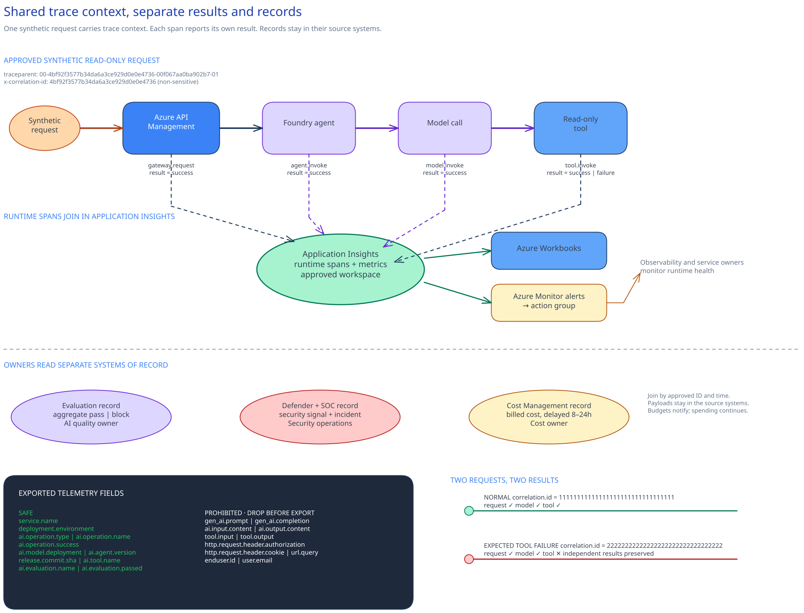

# Implementation - Observability, cost, and operational controls

## Session scope

### What we will do

Deploy **privacy-safe operating controls for one governed service**. The team adds a shared workbook
and three alert rules that route to named owners. It deploys a monthly budget notification, records
cost-allocation and privacy decisions, and keeps an incident runbook. The named Session 14 GitHub
promotion workflow runs the paired smoke check against live telemetry. Its result stays in the
runner's temporary workspace and is not retained in the customer clone.

### Why it matters

Operators need enough joined context to tell whether the service, a tool, or model behavior is
failing. The workbook and alerts support that decision. Cost tags and budget notifications give the
cost owner a delayed billing view. The incident runbook names the owner who contains each failure.

### Boundaries

The application, API Management, agent, model, and tool propagate W3C trace context where their
instrumentation supports it. Evaluation, Cost Management, Defender, and SOC records do not all
carry the same correlation ID. Application Insights stores deployed runtime telemetry. Cost
Management stores billed-cost records, and Defender and the SOC system keep security and incident
records.

Standard telemetry excludes prompts, responses, tool payloads, credentials, query strings, user
identifiers, and personal data. Token metrics estimate usage rather than billed cost. API Management
tracks at most 100 unique values per dimension and 1,000 active time series per metric namespace.
It silently discards data for new values or series beyond either limit. Cost Management billed cost
is authoritative, even though it can lag by 8-24 hours. A budget sends notifications without
stopping resources. Production content logging and user-level cost allocation need separate
approval. Session 14 consumes the payload-free smoke result from its runner workspace. It does not
copy the authoritative service records.

## Architecture

### Architecture at a glance



Treat the request as the spine of the operating view. API Management attaches W3C trace context to
the approved synthetic request. This standard trace identifier follows the work across services.
The agent carries it into model and tool calls, and each span records its own result. Operators can
then follow one request and see which hop failed without treating a tool error as a model error.

Application Insights collects supported runtime spans. Its workbook gives operators one place to
inspect them, and its alert queries notify an owner through Azure Monitor. API Management also
emits bounded token metrics for a faster usage estimate. Cost Management reports the authoritative
billed cost later, normally after an 8-24 hour delay. Keep these clocks separate. An estimate
cannot settle the bill.

Records stay in the systems that produce them. Application Insights stores runtime telemetry, while
the source-controlled API Management policy defines gateway configuration. Cost Management reports
billed cost. Defender and the SOC system keep security and incident records. Shared trace context
connects operating signals without copying those records into one store.

Alerts identify the failure path. The incident runbook assigns containment to the service, tool, AI
quality, or security owner. Stop if trace context breaks, a field carries sensitive data, or a
signal cannot keep tool and model outcomes separate.

This implementation covers correlation, monitoring, notification, and incident paths. The Session
13 GitHub promotion workflow receives a payload-free result from its temporary runner workspace.
It receives no copies of the service records.

[`artifacts/telemetry/telemetry-contract.json`](artifacts/telemetry/telemetry-contract.json) defines
the payload-free signals and context. The workbook and three Kusto Query Language (KQL) alert
queries read that telemetry, while
[`artifacts/operations/incident-runbook.md`](artifacts/operations/incident-runbook.md) assigns each
failure path. The budget Bicep files deploy the separate billing notification.

### Design choices and tradeoffs

| Decision | Chosen approach | Why | What it does not solve | Revisit when |
|---|---|---|---|---|
| Runtime content | Standard telemetry excludes prompts, responses, and tool payloads. | Operators can trace service behavior without turning the monitoring store into a content archive. | Content inspection needs separate, time-limited approval. | A documented diagnostic need cannot be met with payload-free attributes. |
| Trace volume | Apply fixed-rate or rate-limited sampling where traces begin. Preserve each selected trace end to end, and do not sample metrics. | Operators still get joined traces while the team keeps ingestion bounded. | Sampling can miss a rare failure. Approved error and security signals may need to bypass the normal rate. | Baseline volume or failure frequency changes, or the selected language changes its OpenTelemetry behavior. |
| Cost signal | API Management publishes low-cardinality token metrics for operating estimates. Cost Management billed cost is authoritative. | Operators see usage sooner without treating an estimate as an invoice. | Token counts can be incomplete. API Management silently discards new values or series after 100 unique values per dimension or 1,000 active time series per metric namespace. Billed cost normally arrives 8-24 hours later. | The gateway policy or model provider changes. Revisit the choice when allocation dimensions or billing scope change. |

### Architecture guidance

- [Trace agent overview](https://learn.microsoft.com/en-us/azure/foundry/observability/concepts/trace-agent-concept)
  explains the supported Foundry tracing path and agent-type availability.
- [Sampling in Azure Application Insights with OpenTelemetry](https://learn.microsoft.com/en-us/azure/azure-monitor/app/opentelemetry-sampling)
  covers complete-trace preservation, source sampling, and daily-cap cautions.
- [Create and manage budgets](https://learn.microsoft.com/en-us/azure/cost-management-billing/costs/tutorial-acm-create-budgets)
  explains budget timing and notification behavior.

## Before you start

Confirm the following:

- Complete Sessions 01-11. If the earlier controls were implemented outside this series, confirm
  the required state in the table below.
- The [Session 05](../../05-governed-agent-baseline/implementation/README.md) policy assistant and
  [Session 07](../../07-apim-ai-gateway/implementation/README.md) APIM route can process an approved synthetic,
  read-only request without changing production.
- A workspace-based Application Insights component, its Log Analytics workspace, and an approved
  action group already exist.
- The application, gateway, agent, and tool owners can preserve W3C `traceparent` and
  `x-correlation-id`.
- The platform owner records the Foundry agent type. Tracing is generally available for prompt and
  hosted agents. A workflow or external agent remains preview. Stop unless the approved preview-use
  decision names that agent and nonproduction scope.
- The deployment operator recorded for this session has **Monitoring Contributor** at the exact deployment
  resource-group scope and **Log Analytics Reader** at the exact workspace scope. If Application
  Insights or the action group is outside that resource group, assign **Monitoring Reader** at each
  exact resource scope.
- The same operator has **Cost Management Contributor** at the exact subscription scope. Activate
  these human assignments for preflight, deployment, and the
  confirmation check only. Expire or remove them through the approved access process afterward.
- The observability, application, gateway, tool, AI quality, security operations, data-protection,
  and cost owners can resolve the required decisions.
- Application instrumentation is deployed. The gateway owner has reviewed and applied the merge in
  the customer-owned APIM policy source, and baseline telemetry has been reviewed before alert
  thresholds are set.

### Required state when joining here

Every row is required when the numbered prerequisite sessions are not complete.

| Dependency | Required control state and exact record | Owner and observable result |
|---|---|---|
| Runtime | The current deployment record names the Foundry project, immutable agent version, Microsoft Entra agent identity, approved network path, versioned APIM policy, registered tool identities and scopes, and data-policy assignment. | The platform, gateway, tool, and data owners confirm that an approved read-only request reaches only the backend and tool listed in that deployment record. |
| Tracing | The deployed OpenTelemetry and APIM configuration propagates W3C `traceparent` plus one non-sensitive correlation ID across gateway, agent, model, and tool spans. | The observability owner finds one joined operation in the approved workspace, with a separate result on every span. |
| Evaluation | The approved evaluation definition, threshold policy, and latest approved aggregate result name the deployed agent version. | The AI quality owner runs the approved release gate and gets the recorded pass or block result for that version. |
| Security | The confirmed payload-free adversarial summary, Defender onboarding state, and security-event route name the protected agent version. | The security operations owner confirms that prohibited actions are recorded as blocked and one expected runtime signal reaches the Defender or SOC record listed in the route. |

### Implementation files

| Type | File | Consumer |
|---|---|---|
| Runtime | [`artifacts/telemetry/telemetry-contract.json`](artifacts/telemetry/telemetry-contract.json) | Application developers, the observability owner, and preflight scripts |
| Deployment | [`artifacts/infra/main.bicep`](artifacts/infra/main.bicep) | The Azure deployment pipeline |
| Deployment | [`artifacts/infra/main.bicepparam`](artifacts/infra/main.bicepparam) | The Azure deployment pipeline |
| Deployment | [`artifacts/monitoring/workbook.json`](artifacts/monitoring/workbook.json) | Operators and the workbook deployment |
| Runtime | [`artifacts/queries/request-error-rate-alert.kql`](artifacts/queries/request-error-rate-alert.kql) | The request-error scheduled-query alert |
| Runtime | [`artifacts/queries/tool-failure-alert.kql`](artifacts/queries/tool-failure-alert.kql) | The tool-failure scheduled-query alert |
| Runtime | [`artifacts/queries/quality-safety-alert.kql`](artifacts/queries/quality-safety-alert.kql) | The quality and safety scheduled-query alert |
| Deployment | [`artifacts/cost/budget.bicep`](artifacts/cost/budget.bicep) | The subscription deployment pipeline and cost owner |
| Deployment | [`artifacts/cost/budget.bicepparam`](artifacts/cost/budget.bicepparam) | The subscription deployment pipeline |
| Record | [`artifacts/cost/cost-allocation.md`](artifacts/cost/cost-allocation.md) | The cost owner |
| Record | [`artifacts/governance/data-retention-decision.md`](artifacts/governance/data-retention-decision.md) | The observability owner |
| Record | [`artifacts/governance/prompt-response-logging-decision.md`](artifacts/governance/prompt-response-logging-decision.md) | The privacy and observability owners |
| Record | [`artifacts/operations/incident-runbook.md`](artifacts/operations/incident-runbook.md) | The incident commander and service operators |

## Decisions and stop conditions

**Resolve every `__REQUIRED_*__` value before any state change.** Use role or group aliases instead of
personal data. Keep subscription IDs, resource IDs, endpoints, credentials, connection strings, and
customer data out of source control; provide runtime coordinates only in the approved customer
repository or deployment environment.

### Telemetry and correlation

Use W3C Trace Context as the distributed-tracing standard. APIM preserves `traceparent`. The
approved policy adds `x-correlation-id` when the caller did not provide one. The application copies
the correlation ID into a low-cardinality span attribute and propagates both contexts to agent and
tool calls.

`telemetry-contract.json` requires separate gateway, agent, model, tool, evaluation, and security
signals. A tool dependency with `ai.operation.type=tool` must remain a tool result; do not convert
it to a model failure or generic exception.

Stop if any hop breaks trace continuity, a correlation ID contains user or business data, service
names are inconsistent, or a proposed field has unbounded cardinality.

### Privacy, sampling, and retention

Prompts, responses, tool inputs and outputs, authorization and cookie headers, URL query strings,
and user identifiers are excluded from standard telemetry. OpenTelemetry cannot infer the
customer's sensitive-data policy; filtering and redaction happen before export.

Choose fixed-rate or rate-limited source sampling. Do not sample metrics. The observability owner
configures the OpenTelemetry sampler and log filters so error spans, exception records, and approved
security events bypass normal trace sampling. The owner tests that behavior with existing safe
records before approval. Use trace-based log sampling where the selected language supports it. A
daily cap is a last-resort control because it creates a telemetry gap after ingestion stops.

Any content-logging exception needs an approved purpose, isolated scope, access owner, retention,
expiry, and data-protection decision. Stop if content logging is proposed as a default, if the
exception is open-ended, or if sensitive input appears during the confirmation check.

When the exception status is `Disabled`, set purpose, scope, access owner, retention, and expiry to
`N/A`. Supply those details only for an `Approved` exception.

### Alerts, token telemetry, and cost

Review baseline telemetry before choosing alert thresholds. The supplied alerts cover request error
percentage, tool-failure count, and failed AI quality or safety evaluation events. Set thresholds
from that baseline and the approved SLOs, not arbitrary perfect scores. The action group routes to
the operations receiver listed in the alert rule through the common alert schema.

APIM's `llm-emit-token-metric` policy supports at most five custom dimensions. This kit uses only
the low-cardinality service dimensions listed in the policy. API Management tracks at most 100
unique values per dimension and 1,000 active time series per metric namespace. New values or series
beyond either limit are not tracked, and their metric data is silently discarded. Streaming
interruptions and model or provider behavior can also make token counts incomplete. Cost Management
billed cost is authoritative.

The subscription budget sends actual and forecast notifications; it does not enforce a hard stop.
Stop if dimensions contain users, emails, content, request IDs, or free text. Also stop when the
metric would exceed the documented APIM policy limits or when anyone presents the budget as
real-time enforcement.

### Scope and responsibilities

Run this kit only against the approved nonproduction service, Application Insights component,
deployment resource group, action group, and subscription budget. The APIM policy remains in the
gateway owner's repository and is changed through its approved delivery path. Never replace an
API-scope policy that contains authentication, safety, routing, or quota controls.

## Implement

### 1. Complete required decisions

Complete the telemetry, deployment-parameter, and budget-parameter files. Complete the retention,
content-logging, and cost-allocation Markdown records. Keep the **service name identical across the
machine-readable files**. Confirm that the infrastructure definition applies the approved
application, environment, cost-center, owner, and data-classification tags to each target resource.
Use Microsoft’s [log search alert guidance](https://learn.microsoft.com/en-us/azure/azure-monitor/alerts/alerts-create-log-alert-rule)
to check the query, evaluation frequency, and action-group configuration.

Set the environment coordinates in the shell:

```powershell
$approvedSubscriptionId = $env:AZURE_SUBSCRIPTION_ID
$approvedResourceGroupName = $env:OBSERVABILITY_RESOURCE_GROUP
$approvedApplicationInsightsResourceId = $env:APPLICATION_INSIGHTS_RESOURCE_ID
$deploymentLocation = $env:AZURE_DEPLOYMENT_LOCATION
```
```bash
approved_subscription_id="${AZURE_SUBSCRIPTION_ID}"
approved_resource_group_name="${OBSERVABILITY_RESOURCE_GROUP}"
approved_application_insights_resource_id="${APPLICATION_INSIGHTS_RESOURCE_ID}"
deployment_location="${AZURE_DEPLOYMENT_LOCATION}"
```

### 2. Confirm pre-work instrumentation

Use the Azure Monitor OpenTelemetry distro version that supports the application's language.
Configure the Application Insights connection string through the deployment environment, not source
control.
Apply [`telemetry-contract.json`](artifacts/telemetry/telemetry-contract.json):

1. set a stable cloud role and service name;
2. emit separate agent, model, and tool spans with the required attributes;
3. emit payload-free `ai.evaluation` events for sampled production evaluation;
4. propagate `traceparent` and `x-correlation-id`;
5. drop prohibited attributes before export; and
6. configure the approved source sampling and actionable log levels.

Deploy this change through the existing [Session 05](../../05-governed-agent-baseline/implementation/README.md) application path before the session. Stop if a library or
framework automatically captures content and cannot filter it before export.

### 3. Confirm the customer-owned APIM policy

Confirm that the gateway owner's reviewed APIM policy preserves Session 07 authentication,
token-limit, rate-limit, routing, content-safety, and backend controls while it propagates trace
context and emits bounded token metrics.

Do not use `User ID`, `Subscription ID`, request ID, correlation ID, prompt, response, or free text
as a metric dimension.

### 4. Run preflight and inspect both previews

```powershell
.\scripts\preflight.ps1 `
  -ApprovedSubscriptionId $approvedSubscriptionId `
  -ApprovedResourceGroupName $approvedResourceGroupName `
  -ApprovedApplicationInsightsResourceId $approvedApplicationInsightsResourceId `
  -DeploymentLocation $deploymentLocation
```
```bash
./scripts/preflight.sh \
  --approved-subscription-id "$approved_subscription_id" \
  --approved-resource-group-name "$approved_resource_group_name" \
  --approved-application-insights-resource-id "$approved_application_insights_resource_id" \
  --deployment-location "$deployment_location"
```

Preflight parses the JSON and XML artifacts and rejects unresolved decisions across the whole
artifact tree, including Markdown records. It checks telemetry privacy and cardinality, resolves the
Application Insights component and action group, compiles both Bicep templates, and prints:

1. a resource-group what-if for the workbook and three alerts; and
2. a subscription what-if for the monthly budget.

Stop if either preview replaces an existing workbook or alert unexpectedly, targets the wrong
scope, removes an action route, changes unrelated resources, or shows a budget outside the approved
subscription.

### 5. Deploy the workbook, alerts, and budget

After the owners approve both previews:

```powershell
az deployment group create `
  --subscription $approvedSubscriptionId `
  --resource-group $approvedResourceGroupName `
  --template-file .\artifacts\infra\main.bicep `
  --parameters .\artifacts\infra\main.bicepparam

az deployment sub create `
  --subscription $approvedSubscriptionId `
  --location $deploymentLocation `
  --template-file .\artifacts\cost\budget.bicep `
  --parameters .\artifacts\cost\budget.bicepparam
```
```bash
az deployment group create \
  --subscription "$approved_subscription_id" \
  --resource-group "$approved_resource_group_name" \
  --template-file ./artifacts/infra/main.bicep \
  --parameters ./artifacts/infra/main.bicepparam

az deployment sub create \
  --subscription "$approved_subscription_id" \
  --location "$deployment_location" \
  --template-file ./artifacts/cost/budget.bicep \
  --parameters ./artifacts/cost/budget.bicepparam
```

Open the shared workbook. Run the request-error and tool-failure queries over their configured
15-minute windows, then run the quality query over its configured 30-minute window. Each query must
parse and return its expected result column, even when the count is zero. Do not force an alert with
unsafe traffic. The action-group owner uses the existing authorized test path and confirms delivery
to the receiver configured for that alert rule.

## Confirm the result

Set the **approved runtime coordinates**. PowerShell builds the bearer header in memory. Bash feeds a
curl configuration through standard input, with the token removed from curl's environment. Neither
script prints the token, places it on a process command line, or writes it to disk.

```powershell
$env:SESSION12_SMOKE_URL = $env:APPROVED_SYNTHETIC_SMOKE_URL
$env:SESSION12_SMOKE_FAILURE_URL = $env:APPROVED_SYNTHETIC_FAILURE_URL
$env:SESSION12_AI_RESOURCE_ID = $env:APPROVED_APPLICATION_INSIGHTS_RESOURCE_ID
$env:SESSION12_LOG_ANALYTICS_WORKSPACE_ID = $env:APPROVED_LOG_ANALYTICS_WORKSPACE_ID
$env:SESSION12_SMOKE_BEARER_TOKEN = $env:APPROVED_SYNTHETIC_SMOKE_TOKEN
$env:SESSION12_SMOKE_TIMEOUT_SECONDS = "180"
$env:SESSION12_SMOKE_RETRY_SECONDS = "15"
$resultPath = Join-Path $env:RUNNER_TEMP "session12-smoke.json"

.\scripts\smoke.ps1 `
  -Mode Pipeline `
  -Environment nonproduction `
  -CommitSha $env:RELEASE_COMMIT_SHA `
  -ResultPath $resultPath
```
```bash
export SESSION12_SMOKE_URL="${APPROVED_SYNTHETIC_SMOKE_URL}"
export SESSION12_SMOKE_FAILURE_URL="${APPROVED_SYNTHETIC_FAILURE_URL}"
export SESSION12_AI_RESOURCE_ID="${APPROVED_APPLICATION_INSIGHTS_RESOURCE_ID}"
export SESSION12_LOG_ANALYTICS_WORKSPACE_ID="${APPROVED_LOG_ANALYTICS_WORKSPACE_ID}"
export SESSION12_SMOKE_BEARER_TOKEN="${APPROVED_SYNTHETIC_SMOKE_TOKEN}"
export SESSION12_SMOKE_TIMEOUT_SECONDS="180"
export SESSION12_SMOKE_RETRY_SECONDS="15"
result_path="${RUNNER_TEMP}/session12-smoke.json"

./scripts/smoke.sh \
  --mode pipeline \
  --environment nonproduction \
  --commit-sha "${RELEASE_COMMIT_SHA}" \
  --result-path "$result_path"
```

Before either request, the scripts resolve `SESSION12_AI_RESOURCE_ID` through Azure CLI. Its live
`WorkspaceResourceId`, compared without case sensitivity, must equal
`SESSION12_LOG_ANALYTICS_WORKSPACE_ID`. The query is sent only to that workspace.

The normal endpoint accepts an approved read-only body. The separate failure endpoint handles a
lookup for a nonexistent synthetic policy. Its tool dependency must fail while the model records an
independent successful result. Both bodies carry the same run-specific, non-sensitive probe marker
and lower-case release commit SHA. Send that SHA in `x-release-commit-sha`. The application writes
it to the `release.commit.sha` custom property on both correlated request records. The scripts
discard response bodies and retain only safe correlation IDs. Their JSON output contains no request,
response, tool, or telemetry payload.

The request and response trace IDs are normalized to 32 lower-case hexadecimal characters. The
normal and failure IDs must remain distinct after any response `traceparent` override. The
payload-free result keeps both as `normalCorrelationId` and `failureCorrelationId`; the existing
`correlationId` field remains the normal ID for Session 14 compatibility.

Application Insights ingestion is asynchronous. Both scripts query the normal and failure
correlation IDs immediately, then retry until all six required request, model, and tool counts and
both exact commit matches appear, with no missing or mismatched commit property. Readiness starts a
stability check within the same timeout. Three identical summaries, each separated by the retry
interval, must report the same maximum `TimeGenerated` watermark. The third summary is the final
query. It must still show zero probe-marker matches, zero prohibited property names, and zero
missing or mismatched commit values. Any change resets the three-query sequence.

The property-name check comes from `telemetry-contract.json`: `gen_ai.prompt`,
`gen_ai.completion`, `ai.input.content`, `ai.output.content`, `tool.input`, `tool.output`,
`http.request.header.authorization`, `http.request.header.cookie`, `url.query`, `enduser.id`, and
`user.email`. Matching ignores case but preserves each dotted name as one property key.

The default timeout is 180 seconds with a 15-second retry interval. The timeout accepts 30 through
600 seconds, and the retry interval accepts 5 through 60 seconds. The timeout must be at least
twice the retry interval. This leaves room for the initial snapshot and two retries when telemetry
is ready on the first query. A final query can run at the timeout boundary. `telemetryPollAttempts`
counts every telemetry query across readiness and stability, including the initial and final
queries. The result also records the configured timeout and retry interval.

Expected result:

- `status` is `passed` and `commitSha` matches the release;
- the normal operation links its request to successful model and tool dependencies;
- the failure operation contains a failed non-model dependency and a separate successful model
  dependency or model-result event;
- `expectedToolFailure` and `independentModelResult` are `true`;
- `toolAndModelFailureSeparated` is `passed`, and `telemetryPollTimedOut` is `false`;
- `workspaceBindingVerified` and `releaseCommitShaVerified` are `true`;
- `correlationIdsDistinct` and `telemetryIngestionStable` are `true`;
- `normalCorrelationId` and `failureCorrelationId` are safe and different;
- root `commitSha` is present only after both correlated request records match the CLI SHA;
- request count, errors, latency, model deployment, tokens, agent version, tool failure, and
  quality/safety signals appear in their intended views; and
- the probe marker and prohibited payload properties are absent from `AppRequests`,
  `AppDependencies`, `AppEvents`, `AppTraces`, and `AppExceptions`, including each table's
  payload-bearing columns and custom properties.

Stop if the component points to another workspace, either request record lacks the exact release
SHA, the two correlation IDs match, or a hop is missing. A failed-tool route without an independent
model result also stops the check. Treat an unstable watermark, a prohibited dotted property, the
probe marker, or timeout as failure. Do not weaken redaction to make the trace look complete.

## After implementation

Keep the **telemetry definition, alerts, and incident runbook**, together with the workbook
definition, Bicep-consumed alert queries, budget, cost-allocation record, privacy decisions, and
paired smoke scripts. The gateway owner's APIM repository keeps the policy.
Application Insights retains operational telemetry under the approved workspace policy. Foundry,
Defender, APIM, Cost Management, and the SOC system remain the systems of record for their detailed
data.

The service owner sets the operating SLO. The observability owner maintains instrumentation,
sampling, retention, the workbook, and alerts. The gateway owner maintains APIM correlation and
token metrics. The tool owner checks tool span accuracy and independent authorization. The AI
quality owner sets evaluation signals and thresholds. Security operations routes security events
and handles incidents. The cost owner maintains tags and budget thresholds, then reconciles
estimates with billed cost.

During an incident, the incident commander orders containment. The service owner changes the
affected agent or model route, the tool owner disables an affected binding, and the credential
owner revokes or rotates exposed credentials.

This implementation remains scoped to the approved nonproduction service. The named
[Session 14](../../14-cicd-promotion-controls/implementation/README.md) GitHub promotion workflow
calls `implementation/scripts/smoke.ps1` or `smoke.sh` through the fixed mode, environment, commit
SHA, and result-path interface.
It also supplies the seven documented runtime environment inputs. Session 14 requires `status:
passed`, both binding checks, distinct correlation fields, a stable final query, all other positive
checks, `sensitiveInputPresent: false`, `payloadsRetained: false`, and the five-entry
`privacySurfacesChecked` list. The scripts reject a result path outside the GitHub runner's
temporary workspace, so no live check output is retained in this repository.

Restore is manual because application instrumentation and the APIM policy use existing delivery
paths:

1. route the application to the last approved [Session 05](../../05-governed-agent-baseline/implementation/README.md) version if instrumentation causes a
   service fault;
2. restore the previous [Session 07](../../07-apim-ai-gateway/implementation/README.md) API policy through its owning repository, preserving
   authentication, safety, routing, and quota controls;
3. disable only the Session 13 alert rules while correcting a noisy query or threshold;
4. remove only resources listed in the approved Session 13 what-if and tagged
   `implementationSession=12`;
5. delete the exact Session 13 budget only after the cost owner confirms no other workflow depends
   on it; and
6. keep the data needed for an active incident or retention obligation.

Do not disable telemetry, Defender, or SOC routing merely to silence a real operational signal.
