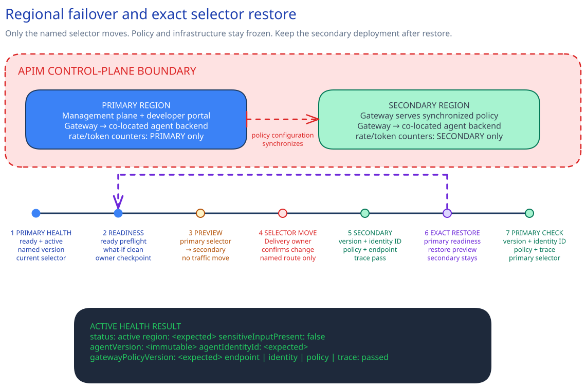

<!-- _class: cover -->

AI Governance Co-implementation · Session 15

# Agent fleet governance, multi-region design, and production rehearsal

180 minutes · Reconcile one governed service, move traffic, and confirm the active path

<!-- Notes: The regional deployment already exists. Today the team rehearses one controlled traffic move and restore path. -->

---

## Why it matters

> Locate one governed service's agent and MCP records in their native services. Then rehearse routing to its approved secondary deployment and check the expected identity reference, policy version, and trace fields.

By the end of the session:

- Foundry Control Plane, Agent 365, and the API inventory resolve the same governed service.
- Regional parameters name the expected agent version, identity, policy, endpoints, and selectors.
- Preflight confirms the Azure resources, API Management topology, customer scripts, and Bicep preview.
- The approved selector reaches the secondary path, or the team restores the primary selector.

<!-- Notes: This checks one service. It does not create fleet-wide lifecycle enforcement. -->

---

<!-- _class: two-column -->

## Architecture and ownership

Native services hold live agent, MCP, identity, policy, security, telemetry, and gateway state.

The repository holds the approved scope, regional inputs, script interfaces, and restore runbook.

The customer change system holds approval and the rehearsal result.

Session 14 remains the path for infrastructure and policy promotion.

<!-- Notes: Identity and registry objects stay in place. Only the traffic selector moves. -->

---

<!-- _class: decision -->

## Implementation tradeoffs

| Decision | Required answer |
|---|---|
| Scope | Exact subscription, regional resource group, change record, and owners |
| Service | Foundry project, immutable agent version, Entra identity, policy version, and Application Insights |
| Topology | Premium (classic) multi-region service or separate regional gateways |
| Routing | External or internal mode, distinct selectors, gateway URLs, and backend URLs |
| Customer interfaces | Existing Bicep entrypoint plus paired PowerShell and Bash health and routing scripts |

One multi-region service keeps its management plane in the primary region and uses regional
counters. Internal mode needs customer-owned cross-region routing and DNS.

<!-- Notes: Premium v2 supports zones, not multi-region deployment. -->

---

<!-- _class: implementation -->

## Implementation path

**Total session: 180 minutes. Guided work: about 120 minutes.**

1. Reconcile the agent and MCP server in their native systems.
2. Complete the control definition, regional parameters, and restore runbook.
3. Run decision preflight.
4. Run ready preflight and review Bicep what-if.
5. Check secondary readiness and preview the selector move.
6. Get delivery-owner approval, move traffic, and check the active path.

The remaining time covers the briefing, final decisions, result check, and operating handoff.

<!-- Notes: Do not use the maintenance window to resolve missing architecture or access decisions. -->

---

## Access and safety gates

| Operator | Required access |
|---|---|
| Inventory | Azure Reader at subscription scope; time-bound PIM activation for privileged Entra AI Reader at tenant scope |
| Security | Purview Data Security AI Viewer; time-bound Entra Security Reader at tenant scope when Defender Unified RBAC does not cover the workload |
| Preview | Built-in Contributor at the exact regional resource group |
| Delivery | Authority to approve the production selector move and restore |

Stop for an unresolved value, wrong scope, missing or ownerless record, equal selectors,
unsupported topology, failed customer script, or unrelated what-if deletion, replacement, tier,
or network change.

**Keep the current selector while a gate is open.**

<!-- Notes: Agent Registry Administrator and Agent ID Administrator are pre-work roles, not standing rehearsal access. -->

---

<!-- _class: implementation -->

## Controlled failover

1. Freeze infrastructure and API Management policy changes.
2. Rerun ready preflight.
3. Check secondary readiness with the approved synthetic request.
4. Preview the primary-to-secondary selector move.
5. Pause for delivery-owner approval.
6. Move only the approved selector pair.
7. Check the active secondary path.

The health script cannot move traffic. The routing script is the sole traffic-changing interface.
Temporary health output stays outside the repository.

<!-- Notes: The wrappers enforce this order and remove their temporary health result. -->

---

<!-- _class: two-column -->

## Confirm and operate

### Confirm once

- Immutable agent version matches.
- Entra identity reference matches.
- API Management policy version matches.
- Endpoint and trace checks pass.
- `sensitiveInputPresent` is false.

### Restore and own

Check primary readiness, preview the return move, get delivery-owner confirmation, restore the
documented selector, and check the primary path.

The platform owner maintains inputs. The service continuity owner maintains wrappers and the
runbook. The secondary deployment stays in service.

<!-- Notes: Expire temporary human role activations after the rehearsal through the approved access process. -->

---

<!-- _class: closing -->

# Thank you!
