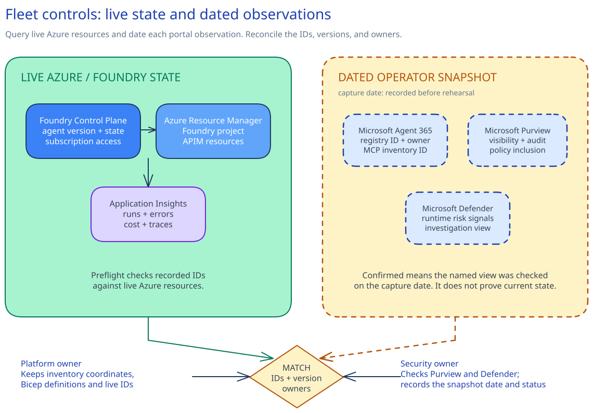

# Implementation - Agent fleet governance, multi-region design, and production rehearsal

## Session scope

### What we will do

Reconcile **one governed service's agent and MCP records**, then rehearse routing to its approved
secondary deployment. The operator checks the active path for the expected immutable agent version,
identity reference, API Management policy version, endpoint, and trace contract. The exact restore
path remains ready.

### Why it matters

A secondary deployment helps only when operators can identify the service, move traffic through an
approved path, and tell whether its controls still work. This rehearsal gives the service and
delivery owners one observable regional result without turning the session into a fleet program.

### Boundaries

Foundry Control Plane supplies the accessible Azure subscription view. Agent 365 supplies the
enterprise registry, while Microsoft Entra remains the identity authority. Purview and Defender
keep their native records. Stable Azure resources are queried live; portal-only observations remain
dated operator snapshots and do not prove current state.

The regional path uses either one Premium (classic) API Management service with an additional
location or separate regional gateways, with gateways close to their backends. Routing changes
traffic to an already deployed secondary path. The rehearsal does not guarantee that a Microsoft
Entra identity object or Agent 365 registry object moves between regions, and it does not enforce
lifecycle rules across the wider fleet. New infrastructure or policy changes return through the
Session 14 promotion control; broader fleet reconciliation stays with normal operations.

## Architecture

### Architecture at a glance



The design separates knowing what will be tested from changing where traffic goes. The inventory
path identifies the governed agent and MCP server. The traffic path moves one approved routing
selector to an existing secondary deployment, then checks that the active route still matches the
recorded controls. A dated administrative view can inform the rehearsal, but it cannot trigger the
traffic change by itself.

The inventory path queries stable Azure resources live. Operators compare that state with dated
observations from Foundry Control Plane, Agent 365, Purview, and Defender. Exact IDs and immutable
versions tie the views to one governed agent. A recorded owner resolves any mismatch. Portal-only
observations remain snapshots; they do not prove current state.

The traffic path begins only after the primary and secondary deployments pass their health checks.
The customer routing control changes the setting that selects the active deployment, moving it
from the healthy primary path to the already deployed secondary path. The active check compares the
agent version and identity reference with the source-controlled regional parameters. It also checks
the API Management policy version, endpoint, and trace contract. A mismatch stops the rehearsal
and sends the operator to the documented restore path.

Azure and the Microsoft product portals report the state they own. The source-controlled regional
parameters and runbook define how the rehearsal runs. The customer change system records its
result. Together, these sources provide the operating view; no single inventory replaces them.

The boundary covers inventory reconciliation and one approved traffic move. It does not move
identity or registry objects, and it does not enforce fleet-wide lifecycle rules. Session 14 owns
infrastructure and policy promotion into both regions. The service owner keeps the routing and
restore path in normal operations.

[`artifacts/fleet/agent-inventory.md`](artifacts/fleet/agent-inventory.md) records the reconciled
IDs, versions, snapshots, and owners. The literal regional selectors and expected control values
live in [`artifacts/regional/region.parameters.json`](artifacts/regional/region.parameters.json).
[`artifacts/regional/failover-runbook.md`](artifacts/regional/failover-runbook.md) defines the
traffic move and restore path.

### Design choices and tradeoffs

| Decision | Chosen approach | Why this shape helps | What it requires | Revisit when |
|---|---|---|---|---|
| Inventory freshness | Query stable Azure resources live. Label every portal-only observation with its snapshot date. | Operators can tell current resource state from a point-in-time administrative view. | An owner must review snapshot fields before the rehearsal because they can become stale. | A portal-only surface gains a stable, supported inventory API. |
| Regional gateway topology | Use either one Premium (classic) multi-region API Management instance or separate regional gateways. Keep every gateway close to its backend. | The service can keep its approved network and isolation design without introducing another routing platform. | One instance retains a primary-region management plane and regional counters. Separate gateways require more release and configuration work. | Management-plane availability or blast-radius needs change. Revisit it as well when tier support, network design, or global limits change. |
| Restore scope | Move only the approved selector. Leave the secondary deployment in place after traffic returns to primary. | The restore stays narrow, and the approved secondary path remains ready. | The team continues to pay for capacity. Session 14 must keep the secondary configuration from drifting. | The continuity plan changes the warm-standby requirement or decommissions the secondary region. |

### Architecture guidance

- [Manage agents at scale in Microsoft Foundry Control Plane](https://learn.microsoft.com/en-us/azure/foundry/control-plane/how-to-manage-agents)
  explains subscription-scoped inventory, access, traces, and fleet metrics.
- [Deploy an Azure API Management instance to multiple Azure regions](https://learn.microsoft.com/en-us/azure/api-management/api-management-howto-deploy-multi-region)
  covers gateway replication, routing, and regional counter behavior.
- [Reliability in Azure API Management](https://learn.microsoft.com/en-us/azure/reliability/reliability-api-management)
  identifies the tiers that support zones or multi-region deployment.

## Before you start

1. Complete Sessions 06-14 or confirm every focused-route substitute below.
2. Approve primary and secondary regions for model availability, quota, data residency, network
   dependencies, API Management capacity, and the tools used by the rehearsed agent.
3. Confirm the customer Bicep entrypoint accepts
   `artifacts/regional/region.parameters.json` and owns the complete regional stack.
4. Give the inventory operator Azure **Reader** at the selected subscription and Microsoft Entra
   **AI Reader** at tenant scope. Use temporary administration outside the session if an existing
   Agent 365 record must be registered or its identity changed.
5. Give the security operator **Purview Data Security AI Viewer** and Microsoft Entra
   **Security Reader** for the dated portal checks.
6. Give the preview operator built-in **Contributor** at the exact regional resource group.
7. Complete the approved secondary-region deployment through the Session 14 promotion path.
8. Prepare a maintenance window, change record, restore authority, and operational record store.
9. Install Azure CLI with Bicep and PowerShell 7.

### Focused-route substitute baseline

| Session control | Required control state | Owner check |
|---|---|---|
| 06 Agent | Foundry project, immutable agent version, model alias, Entra identity | Platform owner invokes that exact version |
| 07 Gateway | Versioned APIM policy and regional selectors listed in the topology file | Gateway owner previews only those selectors |
| 08 Inventory | Exact API, agent, and MCP identifiers with owners | Inventory owner resolves each native identifier |
| 09 Tool | Workload identity, allowed tool operations, egress, version | Tool owner sees the allowed call pass and an unauthorized call block |
| 10 Data | Classification, residency, Purview policy ID, covered agent | Data owner finds the agent in the policy listed in the inventory |
| 11 Evaluation | Threshold policy, approved baseline, passing candidate | Quality owner sees the release gate pass |
| 12 Threat defense | Confirmed payload-free comparison and Defender route | Security owner sees blocked prohibited actions and the expected Defender signal |
| 13 Observability | Telemetry contract, workbook, alerts, smoke interface | Observability owner traces one safe request with separate failures |
| 14 Promotion | Installed preview/apply environments, fixed manifest, manual previous-release restore | Release owner shows approval occurred after what-if |

### Implementation files

| Type | File | Consumer |
|---|---|---|
| Record | [`artifacts/control-definition.json`](artifacts/control-definition.json) | The Session 15 preflight scripts and regional rehearsal operators |
| Record | [`artifacts/fleet/agent-inventory.md`](artifacts/fleet/agent-inventory.md) | The service continuity owner |
| Deployment | [`artifacts/regional/region.parameters.json`](artifacts/regional/region.parameters.json) | The customer Bicep deployment, Session 15 preflight scripts, and routing wrappers |
| Record | [`artifacts/regional/failover-runbook.md`](artifacts/regional/failover-runbook.md) | The service continuity and routing operators |

### Customer health script interface

```powershell
.\customer-regional-health.ps1 `
  -Mode Readiness|Active `
  -Region <azure-region> `
  -ResultPath <temporary-json-path>
```
```bash
./customer-regional-health.sh \
  --mode readiness|active \
  --region <azure-region> \
  --result-path <temporary-json-path>
```

The result contains:

```json
{
  "implementationSession": "15-agent-fleet-multiregion-rehearsal",
  "status": "ready",
  "region": "swedencentral",
  "agentVersion": "recorded-immutable-version",
  "agentIdentityId": "recorded-agent-identity",
  "gatewayPolicyVersion": "recorded-policy-version",
  "endpointStatus": "passed",
  "identityStatus": "passed",
  "policyStatus": "passed",
  "traceStatus": "passed",
  "sensitiveInputPresent": false
}
```

Use `ready` for `Readiness` and `active` for `Active`. The synthetic request contains no customer
data.

### Customer routing script interface

```powershell
.\customer-routing-control.ps1 `
  -Mode Preview|Failover|Restore `
  -FromSelector <selector-from-topology> `
  -ToSelector <selector-from-topology> `
  -ApprovedScope "/subscriptions/<id>/resourceGroups/<name>" `
  -ChangeRecordId <customer-change-record>
```
```bash
./customer-routing-control.sh \
  --mode preview|failover|restore \
  --from-selector <selector-from-topology> \
  --to-selector <selector-from-topology> \
  --approved-scope "/subscriptions/<id>/resourceGroups/<name>" \
  --change-record-id <customer-change-record>
```

`Preview` reads the proposed change. `Failover` and `Restore` change only the two approved
selectors. The script accepts no secret or free-form command.

## Decisions and stop conditions

Resolve every `__REQUIRED_*__` value. Decide:

- the exact resource-group scope and the service, platform, security, and delivery owners listed in the control definition;
- the Foundry project, immutable agent version, Agent 365 registry ID, Entra agent identity, and
  one MCP inventory ID;
- the dated snapshot date for Agent 365, Purview, and Defender portal checks;
- the four visibility statuses, each recorded as `Confirmed` after the operator checks the view listed for that surface;
- `multi-region-instance` or `separate-regional-gateways`;
- `external` or `internal` routing and the two exact selectors;
- API Management resource IDs, tiers, gateway URLs, backend URLs, and approved regions;
- the expected gateway policy version and Application Insights resource;
- the Bicep entrypoint plus paired PowerShell and Bash health and routing script paths; and
- the approved operational record store.

The project and Application Insights resource IDs must match in
`control.inventory.liveAzureResources` and `region.parameters.json`. Preflight checks those
machine-owned identifiers. The operator reviews the dated snapshot against the current portals
before rehearsal.

Stop before routing when:

- a sentinel remains, the approved scope differs, or a source path leaves the repository;
- a live Foundry project, Application Insights resource, or API Management resource cannot be
  queried;
- the dated operator snapshot has an unresolved date, owner, inventory ID, or portal observation;
- a project or Application Insights identifier differs between the control definition and regional
  parameters;
- either routing selector is empty or both selectors are the same;
- either the agent or MCP server has no owner;
- the secondary region lacks the required model, quota, data, network, or tool path;
- one multi-region API Management instance is not Premium (classic);
- separate regional gateways use the same resource ID;
- internal mode lacks customer-owned cross-region routing and DNS;
- regional counters are treated as one global limit;
- the Bicep what-if contains an unrelated deletion, replacement, tier change, or network change;
  or
- either customer script breaks its fixed interface.

**Keep the current selector if any stop condition remains.**

## Implement

### 1. Capture the operator snapshot

Record one governed agent and one MCP server in `fleet/agent-inventory.md`.

- Use one snapshot date for the Foundry Control Plane, Agent 365, Purview, and Defender observations.
- Record `Confirmed` only after the operator checks the view listed for that surface.
- Keep the record labelled as a dated snapshot, not current-state proof.
- Do not paste query output, prompts, traces, or customer data into the repository.

Preflight reads the Foundry project and Application Insights resource live through Azure Resource
Manager. Those stable resource checks stand on their own; they do not make the portal observations
live.

### 2. Resolve the regional parameter contract

Complete `regional/region.parameters.json`. The customer Bicep entrypoint must accept this exact
parameter file as the **single regional deployment contract** for the rehearsal.

For one multi-region instance, use the same API Management resource ID for both paths and include
the secondary region under `additionalLocations`. For separate gateways, use different resource
IDs and apply the same policy revision through Session 14. Check Microsoft’s [API Management
multi-region guidance](https://learn.microsoft.com/en-us/azure/api-management/api-management-howto-deploy-multi-region)
before accepting the selected topology.

Run the decision gate:

```powershell
.\scripts\preflight.ps1 `
  -Phase Decisions `
  -ApprovedScope "/subscriptions/<id>/resourceGroups/<name>"
```
```bash
./scripts/preflight.sh \
  --phase decisions \
  --approved-scope "/subscriptions/<id>/resourceGroups/<name>"
```

### 3. Run live checks and deployment preview

```powershell
.\scripts\preflight.ps1 `
  -Phase Ready `
  -ApprovedScope "/subscriptions/<id>/resourceGroups/<name>"
```
```bash
./scripts/preflight.sh \
  --phase ready \
  --approved-scope "/subscriptions/<id>/resourceGroups/<name>"
```

Ready preflight queries the two stable Azure inventory resources and the live API Management
topology. It then runs Bicep what-if. The script does not deploy or move traffic.

### 4. Run one regional rehearsal

Freeze infrastructure and gateway policy changes. The service owner checks secondary readiness,
and the routing script previews only the approved selectors. Then run:


```powershell
.\scripts\rehearse-failover.ps1 `
  -ApprovedScope "/subscriptions/<id>/resourceGroups/<name>" `
  -ChangeRecordId "<customer-change-record>"
```
```bash
./scripts/rehearse-failover.sh \
  --approved-scope "/subscriptions/<id>/resourceGroups/<name>" \
  --change-record-id "<customer-change-record>"
```

Each wrapper reruns ready preflight immediately before the first health check. It rejects empty or
equal selectors. The delivery owner confirms the production traffic move after the preview, then
the wrapper moves the selector listed in the failover runbook and runs the active health check. It does not change API
Management policy or create a regional resource.

## Confirm the result

Inspect the wrapper output and active service telemetry.

**Expected result:** the immutable agent version is active through the secondary selector and regional
backend. The Entra agent identity, API Management policy version, and trace checks match
`region.parameters.json`. The operational result stays in the customer change record.

If one field differs, restore the primary selector before another change.

## After implementation

Keep the **dated inventory snapshot and regional restore path**, together with the control
definition in the operations repository, regional parameter contract, runbook, and script wrappers.
Azure, Agent 365, Entra, Purview, Defender, Application Insights, and the customer change system
remain the live systems of record.

The platform owner maintains the Bicep entrypoint and inventory coordinates. The service owner owns
capacity, routing, and the runbook. The security owner owns the portal checks. The delivery owner
authorizes the rehearsal.

Restore the primary selector through the approved routing control listed in the failover runbook.
First check primary readiness and preview the selector update. Then get delivery-owner confirmation
for the high-impact change. Restore only the primary selector; the secondary region remains
deployed.

This session governs one agent and one MCP regional rehearsal. Wider fleet lifecycle work belongs
in the customer's normal backlog and operating controls.
